# Lab 01 - Getting Started with SharePoint Embedded

In this module, you'll perform the required steps to enable and prepare your Microsoft 365 tenant to create a new SharePoint Embedded (SPE) application. This includes:

- enable SPE in your Microsoft 365 tenant
- create & register a SPE container type in your tenant
- configure Postman, a utility for executing HTTP calls to the SharePoint Online & Microsoft Graph REST APIs
- initialize the starter app you'll use throughout this workshop

## Enable SharePoint Embedded on your Microsoft 365 Tenant

> [!NOTE]
> The first step is to enable SharePoint Embedded in your Microsoft 365 Tenant.

To enable SharePoint Embedded (SPE), navigate to the Microsoft 365 admin center (`https://portal.microsoft.com`) and sign in with the **Work and School** of your Microsoft 365 tenant's admin account.

Select **Show All** at the bottom of the left-hand navigation, then select **Admin Centers > SharePoint**.


Next, on the SharePoint admin center, select **Settings** in the left-hand navigation.

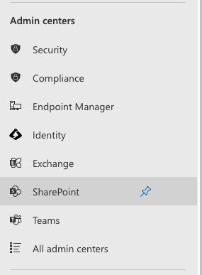

Locate and select **SharePoint Embedded**.

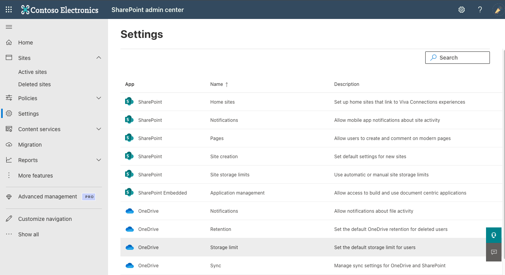

Review the terms of service, select the checkbox next to **I understand, this setting can't be turned off for the preview** and select **Enable** to enable it on your SharePoint Online tenant.

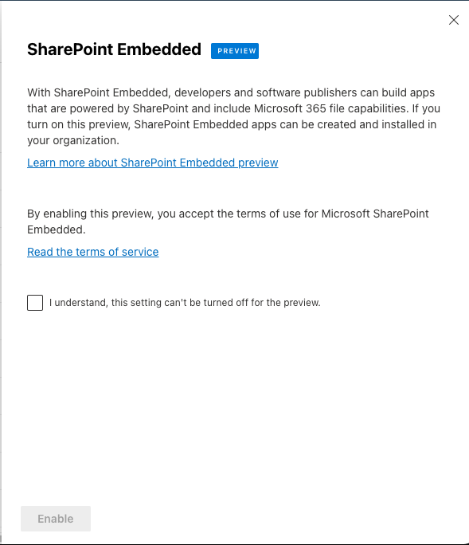

The SharePoint Admin Center will then show the confirmation that SPE is enabled on your tenant.

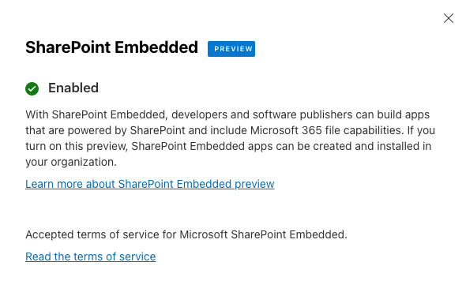

## Setup the Visual Studio Code SharePoint Embedded extension

Microsoft provides developers with a Visual Studio Code (VS Code) extension for SPE to simplify the getting started steps. You'll use this to get started.

Launch **VS Code** and open the **Extensions** view in the Activity Bar by selecting the icon or from the main menu: **View > Extensions**.

At the top of the Extensions side bar, enter **SharePoint Embedded** in the search box. Once found, select the **Install** button in the search results entry to install it.

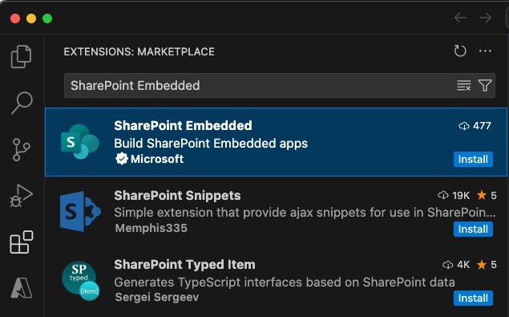

> [!TIP]
> You can also find and install the **SharePoint Embedded** VS Code extension from the Visual Studio Marketplace: [SharePoint Embedded](https://aka.ms/spe-vscode)

Once installed, select the **SharePoint Embedded** extension in the Activity Bar, then select **Sign into Microsoft 365** to connect it to your Microsoft 365 tenant.

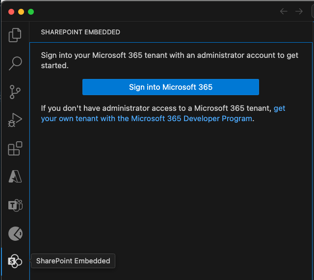

The extension will launch a browser prompting you to sign in. VS Code will wait for you to sign in.

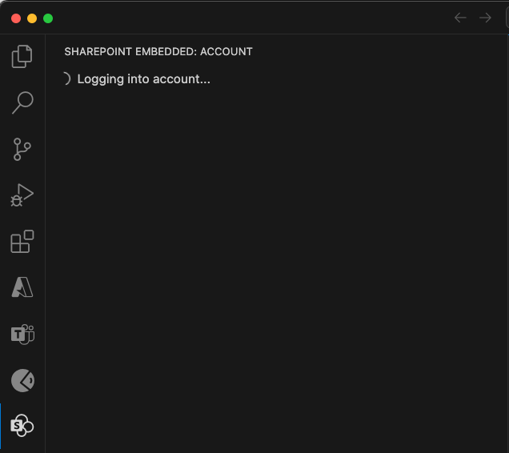

In the browser that opens, sign in with the **Work and School** of your Microsoft 365 tenant's admin account.

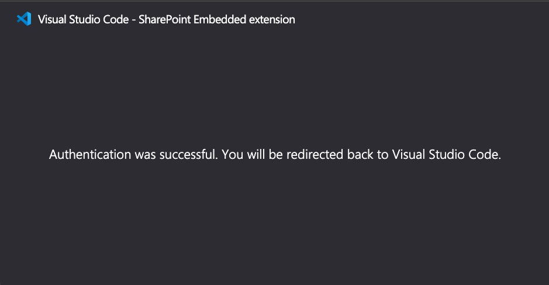

Once you successfully sign in, you can close the browser and go back to VS Code and verify you're now connected to your Microsoft 365 tenant:

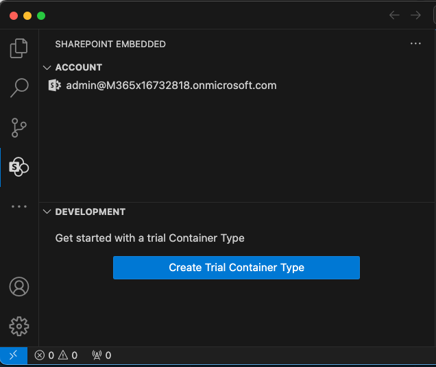

## Create a SharePoint Embedded trial Container Type

With the VS Code SPE extension installed, the first thing we need to do is create a new SPE Container Type for our application.

Start by selecting the **Create Trial Container Type** button in the VS Code SharePoint Embedded extension's **Development** section:


The VS Code Command Palette will open and prompt you to **Create or Choose a Microsoft Entra application**.

In step 1 (of 2), create a new application by entering a name in the **Command Palette**, such as **My First SPE App**, then select **New Microsoft Entra Application: {your app name}** or press <kbd>ENTER</kbd>:


In step 2, enter a name for the SPE Container Type to create, such as **My First SPE Container Type**, then press <kbd>ENTER</kbd>:

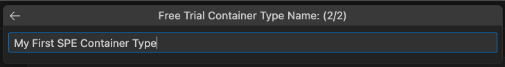

VS Code will display status messages in the lower right corner of the app while creating the Container Type:


After a few seconds, VS Code will prompt you grant consent to some application permissions to your Microsoft Entra app. Select **OK**:

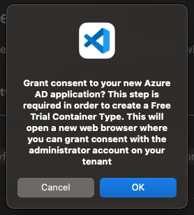

A browser window will launch with the Microsoft Entra consent framework prompt. If necessary, sign in again, and select **Accept** to the permission requests:

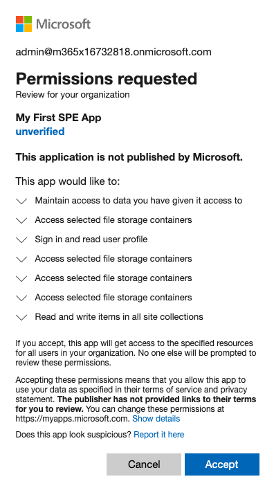

Once you complete this step, the browser popup will disappear. The SPE extension view will display the new Microsoft Entra app (***My First SPE App** in the following screenshot*) and SPE Container Type (***My First SPE Container Type** in the following screenshot*), confirming that everything worked as expected

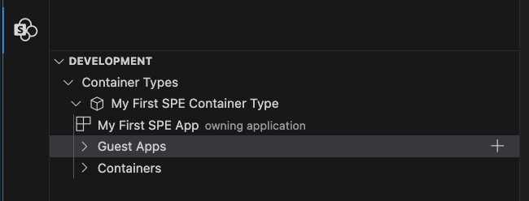

## Configure Postman for SharePoint Embedded

In the next step, we'll configure Postman with a collection of SPE HTTP requests and settings (*environment*). This will not only simply additional setup tasks, but it's a great development tool for testing your calls to the SharePoint Online & Microsoft Graph endpoints.

> [!TIP]
> If you're new to Postman, refer to their to the **[Learning Center > Get Started > Navigating Postman](https://learning.postman.com/docs/getting-started/basics/navigating-postman/)** article in the Postman documentation. Pay special attention to the primary interface section and what different areas are called in the Postman client as this lab will refer to those by name.

### Import SharePoint Embedded HTTP Requests

Launch the Postman app and select **Collections** in the sidebar, then select the **Import** button. When prompted to import a collection, enter the URL `https://aka.ms/spe-postman` which will redirect you to the current collection in the **[SharePoint Embedded Samples](https://github.com/microsoft/SharePoint-Embedded-Samples)** repository on GitHub.

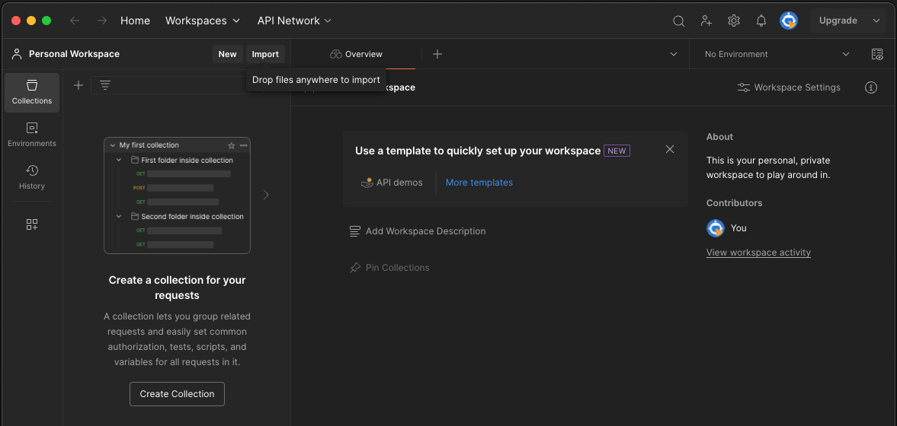

When the import is complete, you will see the **SharePoint Embedded** collection in the Postman sidebar:

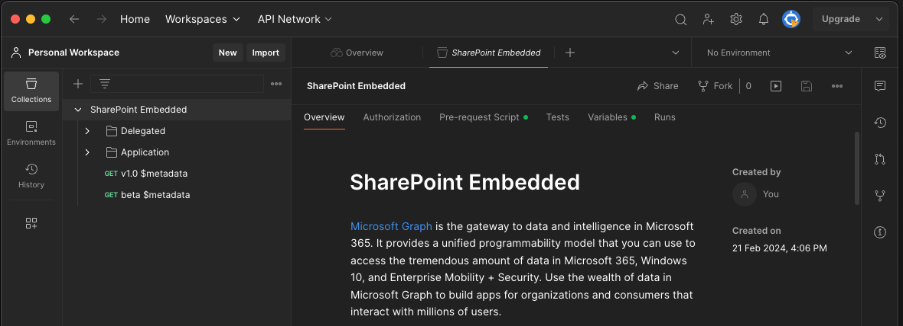

The collection contains HTTP requests for various scenarios you can perform related to SPE. All of the requests rely on variables that you can configure for your SharePoint Embedded scenario, including the Microsoft Entra applications. These variables can be stored in Postman *Environments*.

Let's create an environment to store all variables for our SPE instance.

### Setup a Postman environment for SharePoint Embedded

In VS Code, select the SharePoint Embedded extension. In the **Development** window, expand the **Container Types** node and the named Container Type that you previously created.

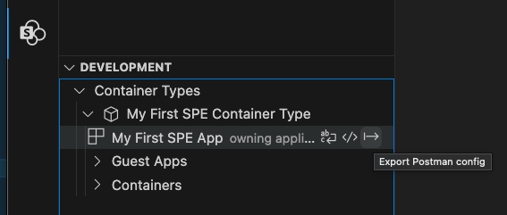

Using your mouse, hover over the Microsoft Entra app you previously created and select the right-most icon (*a vertical bar with an arrow pointing to the right*) to **Export Postman config**.

VSC will display a prompt asking you to confirm saving the Microsoft Entra app's secrets in a plain text file on your computer. Select **OK** and select a location to save the file.

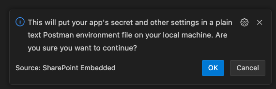

Next, go back to Postman, select **Environments** in the sidebar, then select the **Import** button. When prompted, select the file you exported and saved from the VSC extension.

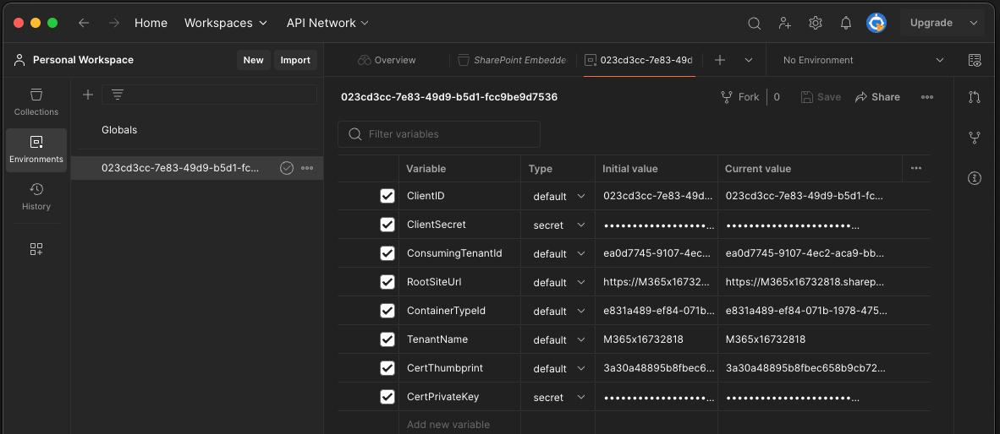

> [!TIP]
> After importing the environment into Postman, consider renaming it to something other than the Client ID of your Microsoft Entra application.
>
> 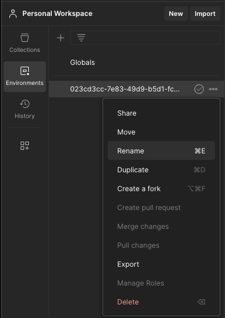

## Register the SharePoint Embedded Container Type with the Microsoft 365 tenant

While you've created a SPE Container Type, you must associate it with your Microsoft 365 tenant before creating any SPE Containers linked to it. To do this, you'll use the requests in the Postman collection.

Within Postman, select **Collections** from the sidebar and then expand collection tree to the request: **SharePoint Embedded > Application > Containers > Register ContainerType**.

Next, make sure you have the Postman environment that you previously imported to use the variables for your environment. Select the environment in the Postman workbench from the selector in the upper-right portion of the Postman interface (*hint: it's on the same horizontal row as the tabs*).

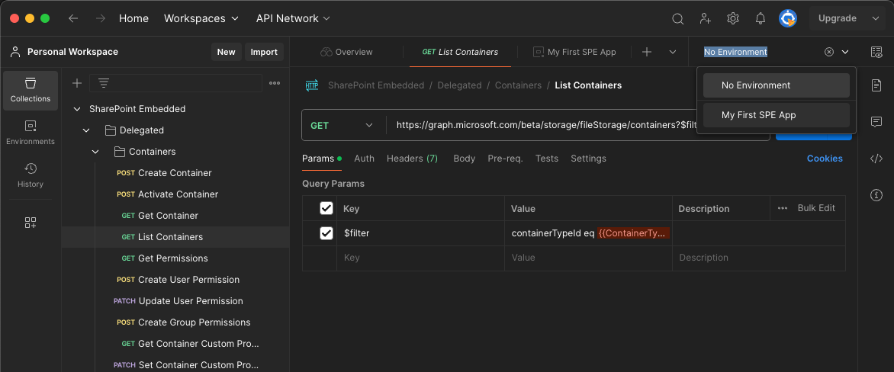

Next, select the **Send** button to execute the request to register the Container Type in your Microsoft 365 environment.

If everything works, you should the response at the bottom half of the workbench indicated with a status code of **200 OK**.

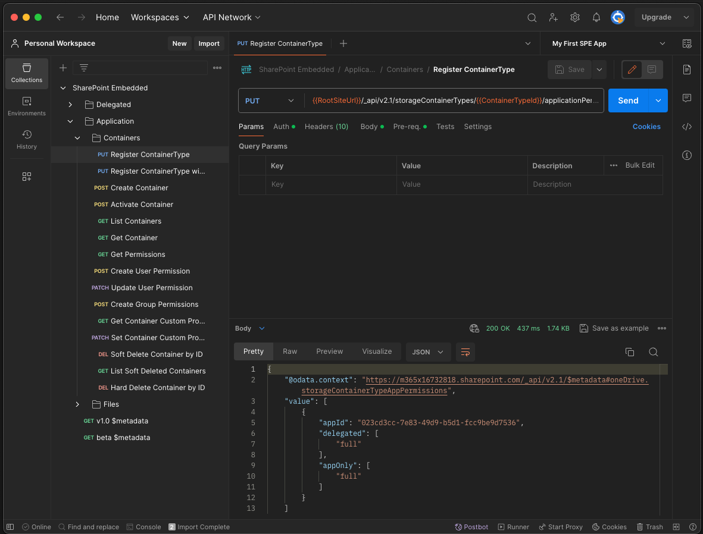

## Create a SharePoint Embedded Container with Postman

Now, let's verify everything has worked with the setup by creating your first SPE Container linked to the existing SPE Container Type.

From the **Collections**, select the request **SharePoint Embedded > Delegated > Containers > Create Container** & verify your environment is selected. Select **Send** to execute the request:

If it succeeds, you'll see a response with a status code of **201 Created**...

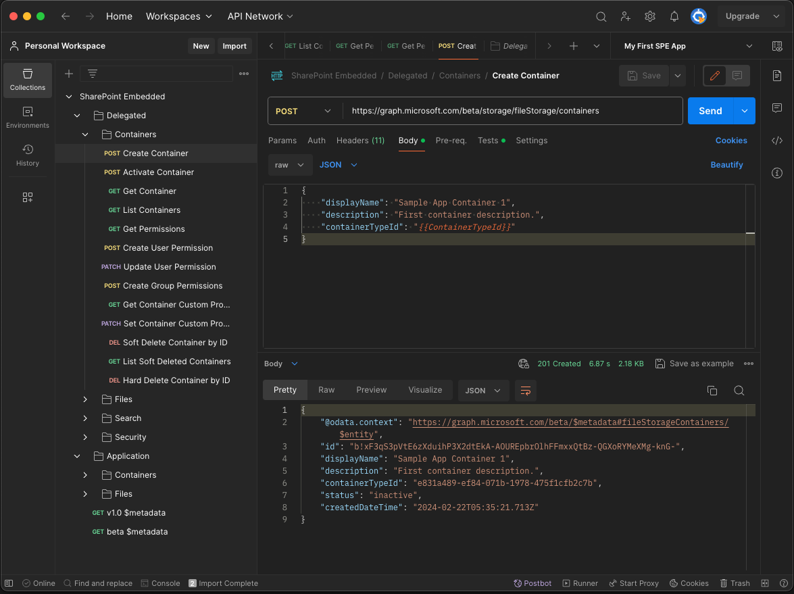

... however if this is the first time you're executing a request that uses a delegated permission, it will likely fail with a status of **401 Unauthorized** and an error code `InvalidAuthenticationToken` and a error message of `Access token is empty`.

The most likely cause of of this error is because you haven't completed the permission consent process and obtained an access token for a delegated permission with SPE. To address this, you manually request an access token in Postman which will also retrieve a refresh token. This token will be stored in your Postman environment for future use. In addition, the collection is configured to automatically refresh the token if it expires or is about to expire.

### Consent the delegate permissions and obtain an access token

To manually initiate the consent process and obtain an access token, in Postman, **Collections** and then select the **SharePoint Embedded > Delegated** folder.

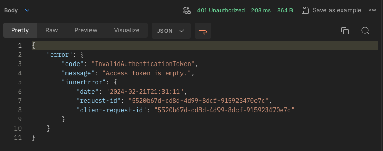

Then select the **Authorization** tab in the workbench.

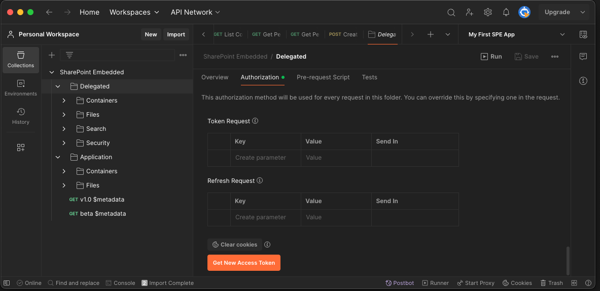

If you scroll through the **Authorization** tab, you'll notice there's no token listed in the **Current Token** section. This is the root of our problem: our request returned a `InvalidAuthenticationToken` error because the request was missing the token.

Scroll to the bottom of the tab and select **Get New Access Token**. This will initiate a process that launches a browser that will take you to Microsoft Entra's login & common consent framework via its authorization endpoint.

Sign in with the **Work and School** of your Microsoft 365 tenant's admin account and accept the permission consent request by selecting **Accept.**

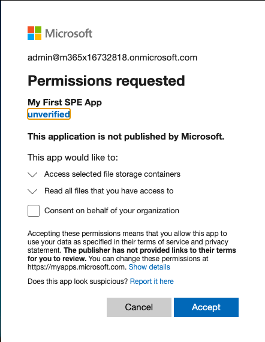

When you finish the consent process, Postman will display a confirmation dialog that the authentication is complete. Select the **Proceed** button to save your changes.

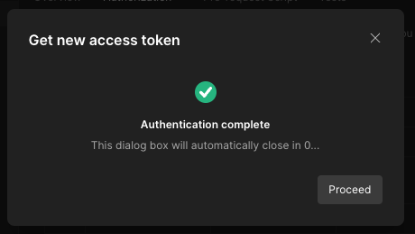

Next, in the next confirmation dialog **Manage Access Tokens**, you'll see the access token Postman received. Save this token in your configuration by selecting the **Use Token** button.

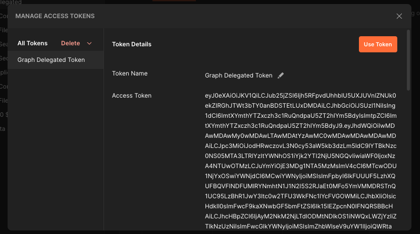

You should now see an access token in the **Authorization** tab of the **Delegated** folder in your collection.

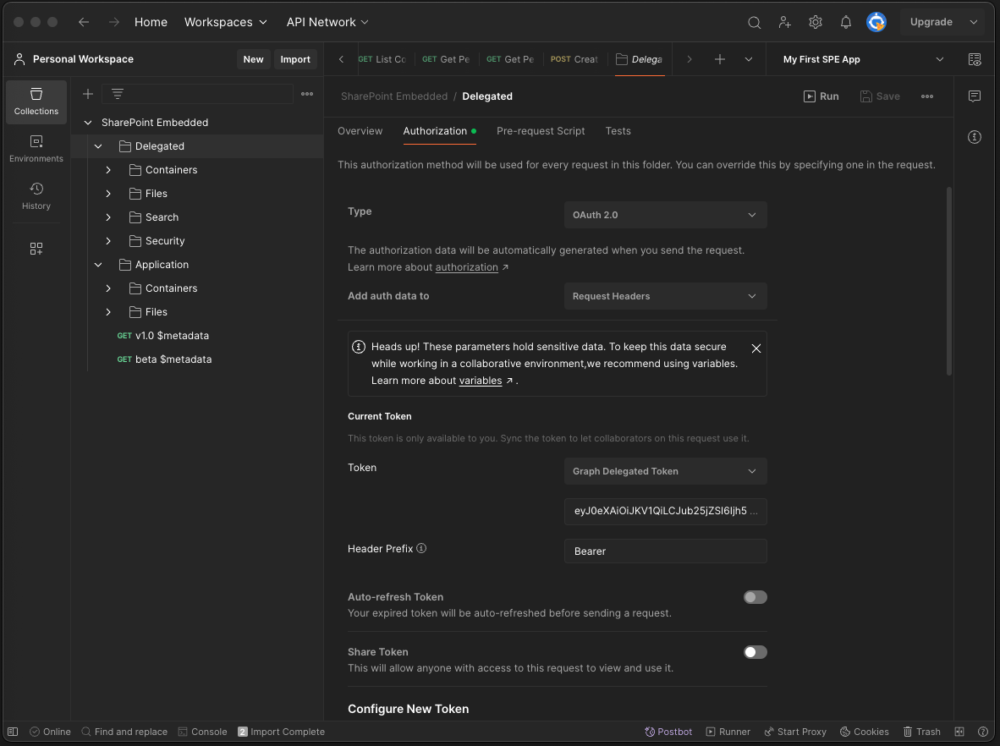

At this point, you can retry the request to create a new SPE Container.

## Initialize the starter app

The labs in this workshop are intended to help you learn how to work with SPE. Thi sis done by creating a sample solution that consists of two applications:

- **Client-side React-based single-page app (SPA)** - This is the user experience that your customers will use to interact with your SPE containers. Most SPE-related tasks can be accomplished with client-side calls to Microsoft Graph REST APIs. However, some tasks require additional permissions (ie: app-only) that must be performed server-side.
- **Server-side API server** - This is a REST API Node.js-based web server that the SPA will utilize to perform certain tasks.

Before moving on, let's get the apps setup.

1. Ensure you have a local copy, either by downloading the content in this repository or cloning the repository locally to your developer environment.
1. From the console, change to the root folder of the [sample-app/00-starter](../sample-app/00-starter) project and install it's dependencies by executing the following command:

    ```console
    npm install
    ```

1. Next, start the app by executing the following command:

    ```console
    npm start
    ```

    The start process will build the client-side & server-ide apps, start two local web servers, and load the client-side app's homepage in your default browser: `http://localhost:3000/`

1. Click through the application to get a feel of how it works.

    > [!IMPORTANT]
    > Don't worry about interacting with the app, including creating, editing, or deleting anything you see. The app is using static mocked data and doesn't make any changes to your SPE environment. That's what the remainder of the labs in this workshop will guide you though.

    The app implements some of the most common functionality and tasks you'll perform with a real-world SPE application including:

    - sign-in to your SPE Microsoft Entra app
    - working with containers
      - create, search, and view contents
      - modify permissions
      - modify custom properties
    - working with files
      - upload, update, delete, and view files
      - create folders
      - search files

## Summary

In this module, you performed the required steps to enable and prepare your Microsoft 365 tenant to create a new SharePoint Embedded (SPE) application. This included:

- enabling SPE in your Microsoft 365 tenant
- creating & registering a SPE container type in your tenant
- configured Postman, a utility for executing HTTP calls to the SharePoint Online & Microsoft Graph REST APIs
- initialized the starter app you'll use throughout this workshop
