# Lab 02 - Working with Containers & Files

In this hands-on lab, you'll start adding some core functionality to your first SharePoint Embedded (SPE) application. First, you'll update the app with the necessary credentials and IDs you collected in the previous lab. Then you'll convert the app from using fake data reading and writing real data to your SPE partition, including:

- [Add support for user login to the client-side app](#add-support-for-user-login-to-the-client-side-app)
- [List all SPE Containers](#list-all-spe-containers)
- [Create SPE Containers](#create-spe-containers)
- [Manage Container permissions](#manage-container-permissions)
- [Manage Container custom properties](#manage-container-custom-properties)
- [Working with files and folders in Containers](#working-with-files-and-folders-in-containers)
- [Add search for content and Containers](#add-search-for-content-and-containers)

> [!IMPORTANT]
> This lab assumes you are working with the existing server-side API & React SPA projects found in the [sample-app/01-starter](../sample-app/01-starter/) folder. This sample app implements all functionality in the React SPA using fake data. Throughout this lab, you will replace all fake data with code that will read and write to the SPE partition in your Microsoft 365 tenant.
>
> **If you elect to start from the checkpoint instead of using the project you were updating in th e previous lab, remember to first install all the project's dependencies by running the `npm install` command in the root of the project.** *[Pay close attention to the caution alert from lab 1](01-getting-started-with-spe.md#initialize-the-starter-app).*
>
> At the end of this lab, your project should mirror the functionality in the projects found in the [sample-app/02-checkpoint](../sample-app/02-checkpoint/) folder. If you have trouble along the way, refer to that project for the working sample.

## Add Microsoft Entra app credentials and SPE IDs

Before you start updating the code in the sample project, let's apply the unique details from your Microsoft 365 tenant, Microsoft Entra application, and SharePoint Embedded from the previous lab.

### Update the server-side app's .env file

Open the environment variable settings for the client-side project, **./.env**. Using the Postman environment created in the previous lab, copy the values to the corresponding values in the **.env** file.

> [!TIP]
> Use the following table to help map the correct values

| Postman Collection Setting |       .env property       |
| :------------------------- | :------------------------ |
| ConsumingTenantId          | `ENTRA_APP_TENANT_ID`     |
| ClientID                   | `ENTRA_APP_CLIENT_ID`     |
| ClientSecret               | `ENTRA_APP_CLIENT_SECRET` |
| ContainerTypeId            | `CONTAINER_TYPE_ID`       |

The environment variables will be added to the server-side process when the app starts using an npm script defined in the **./package.json** file. This is done using the [env-cmd](https://www.npmjs.com/package/env-cmd) package.

Notice the npm script `start:backend` in the **./package.json** file uses env-cmd to inject the variables in **./.env** silently into the Node process that starts the server-side REST API server:

```console
env-cmd --silent -f .env node ./server/index.js
```

### Update the client-side app's config.ts file

The client-side SPA app won't run server-side and therefore it won't have access to the environment variables in the running process. Open the **./src/common/config.ts** file and repeat the steps above for this file:

> [!TIP]
> Use the following table to help map the correct values

| Postman Collection Setting |     config.ts constants      |
| :------------------------- | :--------------------------- |
| ClientID                   | `CLIENT_ENTRA_APP_CLIENT_ID` |
| ContainerTypeId            | `CONTAINER_TYPE_ID`          |

Next, for the `CLIENT_ENTRA_APP_AUTHORITY` constant, set it's value to the `https://login.microsoftonline.com/{ENTRA_APP_TENANT_ID}/`.

> [!NOTE]
> For example, if the tenant ID is `ea0d7745-9107-4ec2-aca9-bb96a266594d`, this should be: `https://login.microsoftonline.com/ea0d7745-9107-4ec2-aca9-bb96a266594d/`.

Next, for the `API_SERVER_URL` constant, set it's value to `http://localhost:3001`. This is the URL of our server-side REST API server.

## Add Microsoft Graph, SharePoint Online, and SharePoint Embedded permissions

With the credentials configured in the client-side app, the next step is to create a list of constants for the scopes (*aka: permissions*) in our application.

### Add server-side scopes

Add a new file, **./server/common/scopes.ts** to the server-side project. Next, add the following Microsoft Graph scopes to the file:

```typescript
export const GRAPH_USER_READ = 'User.Read';
export const GRAPH_USER_READ_ALL = 'User.Read.All';
export const GRAPH_FILES_READWRITE_ALL = 'Files.ReadWrite.All';
export const GRAPH_SITES_READ_ALL = 'Sites.Read.All';
export const GRAPH_OPENID_CONNECT_BASIC = ['openid', 'profile', 'offline_access'];
```

Add a single SharePoint Online scopes that's necessary to work with SharePoint Embedded Containers:

```typescript
export const SPE_FILESTORAGECONTAINER_SELECTED= 'FileStorageContainer.Selected';
```

### Add client-side scopes

Add a new file, **./src/common/scopes.ts** to the client-side project. Next, add the following Microsoft Graph scopes to the file:

```typescript
export const GRAPH_USER_READ = 'User.Read';
export const GRAPH_USER_READ_ALL = 'User.Read.All';
export const GRAPH_FILES_READWRITE_ALL = 'Files.ReadWrite.All';
export const GRAPH_SITES_READ_ALL = 'Sites.Read.All';
export const GRAPH_OPENID_CONNECT_BASIC = ['openid', 'profile', 'offline_access'];
```

Next, add a custom scope that was created on the Microsoft Entra application that the VS Code SPE Extension created for us:

```typescript
export const SPE_CONTAINER_MANAGE= 'Container.Manage';
```

> [!TIP]
> You can see this custom scope in the [Microsoft Entra admin center](https://entra.microsoft.com). Select **Applications > App Registrations** in the navigation. On the **App registrations** page, select **App applications**, and then select the Microsoft Entra application you created in the previous lab.
>
> The custom scope can be found on the **Expose an API** page, listed under the **Scopes** section. Select the link to open the **Edit a scope** panel to see the custom scope name: **Container.Manage**:
>
> 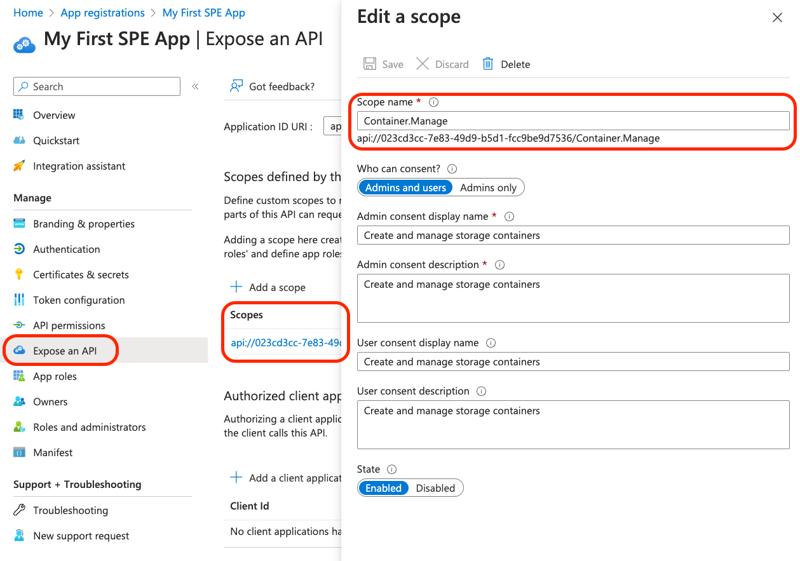

Finally, add a single SharePoint Online scopes that's necessary to work with SharePoint Embedded Containers:

```typescript
export const SPE_FILESTORAGECONTAINER_SELECTED= 'FileStorageContainer.Selected';
```

Finally, add an `export` statement to the end of the **./src/common/index.ts** file:

```typescript
export * from './scopes';
```

At this point, our server-side and client-side apps are ready to start adding some functionality to them!

## Add support for user login to the client-side app

The first step is to add support for users to login to our client-side application using their Microsoft work & school accounts. For this, you'll use the [Microsoft Graph Toolkit](https://learn.microsoft.com/graph/toolkit/overview)'s **Login** component.

The Microsoft Graph Toolkit (MGT) makes configuration easy with their implementation of providers and React components. To start, you need to create and configure global Microsoft Graph provider the entire application can use.

### Configure a global Microsoft Graph provider

Locate and open the root of the web application, **./src/index.tsx**.

Start by adding the following `import` statements after the existing `import` statements to add the MGT providers and MSAL v2 provider:

```typescript
import { Providers } from "@microsoft/mgt-element";
import { Msal2Provider } from "@microsoft/mgt-msal2-provider";
```

Next, add `import` statements to our client-side **config.ts** and **scopes.ts** files to simplify obtaining credentials and scopes:

```typescript
import * as Config from "./common/config"
import * as Scopes from "./common/scopes";
```

The last step is to create the global provider. Add the following code after the `import` statements, but before the existing `ReactDOM.createRoot()` call:

```typescript
Providers.globalProvider = new Msal2Provider({
  clientId: Config.CLIENT_ENTRA_APP_CLIENT_ID,
  authority: Config.CLIENT_ENTRA_APP_AUTHORITY,
  scopes: [
    ...Scopes.GRAPH_OPENID_CONNECT_BASIC,
    Scopes.GRAPH_USER_READ_ALL,
    Scopes.GRAPH_FILES_READWRITE_ALL,
    Scopes.GRAPH_SITES_READ_ALL,
    Scopes.SPE_FILESTORAGECONTAINER_SELECTED
  ]
});
```

### Create a new custom React hook to reflect the user's authentication status

Before you add the MGT **Login** control, create a new custom React hook to reflect the user's authentication status.

Add a new file, **./src/components/useIsSignedIn.ts** and add the following code to it:

```typescript
import {
  useState,
  useEffect
} from "react";
import {
  Providers,
  ProviderState
} from "@microsoft/mgt-element";

export function useIsSignedIn() {
  const [isSignedIn, setIsSignedIn] = useState(false);

  useEffect(() => {
    const updateState = async () => {
      const provider = Providers.globalProvider;
      setIsSignedIn(provider && provider.state === ProviderState.SignedIn);
    };

    Providers.onProviderUpdated(updateState);
    updateState();

    return () => {
      Providers.removeProviderUpdatedListener(updateState);
    }
  }, []);

  return isSignedIn;
}
```

This custom React hook will use the MGT Provider to determine if the user's signed in. The signed in state is reflected in the `isSignedIn` property that's returned.

### Add sign-in support to the client-side application

Everything is now setup to add the MGT **Login** component to support users signing into the client-side application.

Locate and open the core of our application, **./src/App.tsx**.

Add the following `import` statements immediately after the existing `import` statements to import the custom React hook, the MGT **Login** component:

```typescript
import { useIsSignedIn } from "./components/useIsSignedIn";
import { Login } from "@microsoft/mgt-react";
```

Add another `import` statement to import a few objects from the MSAL v2 browser package that you'll use to authenticate the user:

```typescript
import {
  InteractionRequiredAuthError,
  PublicClientApplication
} from "@azure/msal-browser";
```

Next, add `import` statements to our client-side **config.ts** and **scopes.ts** files to simplify obtaining credentials and scopes:

```typescript
import * as Config from "./common/config"
import * as Scopes from "./common/scopes";
```

Within the `App` component, add a constant to track the user's signed in status from the custom React hook:

```typescript
const isSignedIn = useIsSignedIn();
```

Next, add a new method, `promptForContainerConsent()`, that you'll use to sign the user in. This will do the following:

1. Create a `tokenRequest` that specifies the scopes the user must consent to and the URL (`redirectUri`) of the client-side application after they successfully sign in.
1. Create a new `PublicClientApplication` object, configured for the Microsoft Entra application created in the previous lab.
1. Attempt to obtain an access token silently, but if that fails, obtain it via a popup.

```typescript
const promptForContainerConsent = async (event: CustomEvent<undefined>): Promise<void> => {
  const tokenRequest = {
    scopes: [Scopes.SPE_FILESTORAGECONTAINER_SELECTED],
    redirectUri: `${window.location.protocol}://${window.location.hostname}${(window.location.port === '80' || window.location.port === '443') ? '' : ':' + window.location.port}`
  };

  const msalInstance = new PublicClientApplication({
    auth: {
      clientId: Config.CLIENT_ENTRA_APP_CLIENT_ID,
      authority: Config.CLIENT_ENTRA_APP_AUTHORITY
    },
    cache: {
      cacheLocation: 'localStorage',
      storeAuthStateInCookie: false,
    },
  });

  msalInstance.acquireTokenSilent(tokenRequest)
    .then(response => {
      console.log('tokenResponse', JSON.stringify(response));
    })
    .catch(async (error) => {
      if (error instanceof InteractionRequiredAuthError) {
        return msalInstance.acquireTokenPopup(tokenRequest);
      }
    });
}
```

Now you can add the MGT **Login** control to your app and configure it to call the `promptForContainerConsent()` when the login process completes.

Within the `return()` statement, locate the following code...

```html
<div>login | current user</div>
```

... and replace it with the following MGT **Login** control:

```tsx
<Login loginCompleted={promptForContainerConsent} />
```

In order to read and write to SPE Containers, users must be signed in. So, if a user isn't signed in, there's no need to show our SPE Containers selector or the contents within.

Update the `App` component to only show the **Containers** component if the user is signed in.

Within the `return()` statement, locate the following code...

```tsx
<Containers />
```

... and replace it with the following:

```tsx
{isSignedIn && (<Containers />)}
```

Now, the **Containers** component will only be rendered when the user is signed in.

### Test the user login process

Test the client-side application for the sign-in process.

Start the client-side application by running the following command at the root of the project:

```console
npm run start:frontend
```

After building the application, the process will launch your default browser and navigate to the root of our React SPA.

When the app loads, select the **Sign In** button:

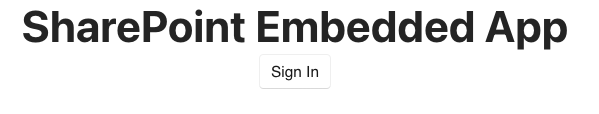

When prompted, sign-in using an account with admin access to your Microsoft 365 tenant.

If this is the first time you've run the app, Microsoft Entra will send you through the common consent process to grant the necessary scopes to the Microsoft Entra application created in the previous lab.

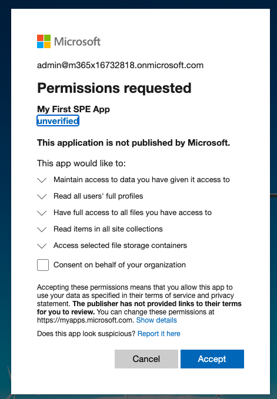

Review the listed permissions. While not necessary, simplify the rest of the lab by selecting the checkbox to **Consent on behalf of your organization** so other users won't have to go through the consent process. Finally, select the **Accept** button.

Once you've signed in successfully, you'll be redirected back to the React SPA application. Notice how the currently signed-in user is displayed as well as our **Containers** component:

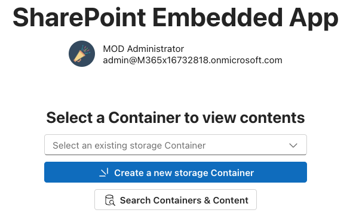

At this point, the application now supports signing users in.

## List all SPE Containers

Let's start adding functionality to the client-side app by listing all the existing SPE Containers.

Working with SPE Container objects requires using an [OAuth 2.0 on-behalf-of](https://learn.microsoft.com/entra/identity-platform/v2-oauth2-on-behalf-of-flow) (OBO) access token for the user. To do this, you must authenticate using a client ID and secret in a server-side process.

So, before we can update our client-side application, we need to create a server-side process to authenticate and obtain a list of all the SPE Containers. Our client-side application will then call our server-side API that will return the SPE Containers.

### Update the server-side API obtain OBO access tokens from Microsoft Entra

The first step is to setup our server-side API to obtain OBO access tokens from Microsoft Entra.

Start by creating a new file, **./server/common/config.ts**, that returns an MSAL configuration object we'll reuse multiple times in our server-side API. Add the following code to this file to create and export the MSAL configuration:

```typescript
import * as MSAL from "@azure/msal-node";

export const msalConfig: MSAL.Configuration = {
  auth: {
    authority: `https://login.microsoftonline.com/${process.env['ENTRA_APP_TENANT_ID']!}/`,
    clientId: process.env['ENTRA_APP_CLIENT_ID']!,
    clientSecret: process.env['ENTRA_APP_CLIENT_SECRET']!
  },
  system: {
    loggerOptions: {
      loggerCallback(loglevel: any, message: any, containsPii: any) {
        console.log(message);
      },
      piiLoggingEnabled: false,
      logLevel: MSAL.LogLevel.Verbose,
    }
  }
};
```

Next, create another file, **./server/common/auth.ts**, that will return the tuple `getGraphToken()` that will:

1. Create a token request object for Microsoft Graph. The configuration includes the necessary permissions and uses the current user's access token as the assertion to obtain the OBO access token from Microsoft Entra.
1. The configuration is used by a provided MSAL `ConfidentialClientApplication` to obtain an OBO token.
1. If successful, two values are returned by the tuple: a boolean indicating the process was successful & the OBO access token that can be used to authenticate requests to Microsoft Graph.

Add the following code to the new **auth.ts** file:

```typescript
import { ConfidentialClientApplication } from "@azure/msal-node";
import 'isomorphic-fetch';
import * as MSGraph from '@microsoft/microsoft-graph-client';
import * as Scopes from './scopes';

export const getGraphToken = async (confidentialClient: ConfidentialClientApplication, token: string): Promise<[boolean, string | any]> => {
  try {
    const graphTokenRequest = {
      oboAssertion: token,
      scopes: [
        Scopes.GRAPH_SITES_READ_ALL,
        Scopes.SPE_FILESTORAGECONTAINER_SELECTED
      ]
    };

    const oboGraphToken = (await confidentialClient.acquireTokenOnBehalfOf(graphTokenRequest))!.accessToken;
    return [true, oboGraphToken];
  } catch (error: any) {
    const errorResult = {
      status: 500,
      body: JSON.stringify({
        message: `Unable to generate Microsoft Graph OBO token: ${error.message}`,
        providedToken: token
      })
    };
    return [false, errorResult];
  }
}
```


### Create a new `/listContainers` endpoint on the REST API server

With the authentication and token acquisition utilities created, you can now create a new REST API endpoint to retrieve SPE Containers for your client-side application.

Create a new file, **./server/listContainers.ts**, and add the following `import` statements:

```typescript
import {
  Request,
  Response
} from "restify";
import * as MSAL from "@azure/msal-node";
import 'isomorphic-fetch';
import * as MSGraph from '@microsoft/microsoft-graph-client';
import { getGraphToken } from "./common/auth";
import { msalConfig } from "./common/config";
```

Next, create a new instance of the MSAL `ConfidentialClientApplication` using the configuration you previously created. Add this after the `import` statements:

```typescript
const confidentialClient = new MSAL.ConfidentialClientApplication(msalConfig);
```

Create and export a new constant, `listContainers`, that will accept the request and response objects from the API server. Add a single check at the start of the application to validate the request includes an access token in the request header:

```typescript
export const listContainers = async (req: Request, res: Response) => {

  if (!req.headers.authorization) {
    res.send(401, { message: 'No access token provided.' });
    return;
  }

}
```

> [!IMPORTANT]
> To save time in this lab, we're assuming the signed in user is allowed to use the application. It's also  assumed the access token is valid as it will be used to obtain the OBO token - if it wasn't valid, Microsoft Entra wouldn't return an OBO token.
>
> In a production application, you should validate the access token in the header to ensure it's intended for our API server (the `audience`) and that it includes the necessary permissions our app requires (ie: **Container.Manage**).

Next, add the following code to the end of the `listContainer()` method to extract the user's access token and use it to obtain an OBO token for Microsoft Graph. If this process fails, return the response back to the caller:

```typescript
const [bearer, token] = req.headers.authorization.split(' ');

const [graphSuccess, graphTokenRequest] = await getGraphToken(confidentialClient, token);

if (!graphSuccess) {
  res.send(200, graphTokenRequest);
  return;
}
```

Assuming the acquisition of the OBO access token was successful, use it to create an authentication provider. Add the following code to the end of the `listContainers()` method:

```typescript
const authProvider = (callback: MSGraph.AuthProviderCallback) => {
  callback(null, graphTokenRequest);
};
```

Finally, use the `authProvider` to create a configured and initialized instance of the Microsoft Graph JavaScript client. Then, use the client to request all SPE storage Containers in your Microsoft 365 tenant that are linked to the Container Type you created in the previous lab. Add the following code to the end of the `listContainers()` method:

```typescript
try {
  const graphClient = MSGraph.Client.init({
    authProvider: authProvider,
    defaultVersion: 'beta'
  });

  const graphResponse = await graphClient.api(`storage/fileStorage/containers?$filter=containerTypeId eq ${process.env["CONTAINER_TYPE_ID"]}`)
                                         .get();

  res.send(200, graphResponse);
  return;
} catch (error: any) {
  res.send(500, { message: `Unable to list containers: ${error.message}` });
  return;
}
```

The last step is to wire the `listContainer` object to the API server.

Locate and open the **./server/index.ts** file.

Add the following `import` statement immediately after the existing `import` statements:

```typescript
import { listContainers } from "./listContainers";
```

Next, add the following code ot the end of the file to map the `listContainers` handler to HTTP GET requests on our API server:

```typescript
server.get('/api/listContainers', async (req, res, next) => {
  try {
    const response = await listContainers(req, res);
    res.send(200, response)
  } catch (error: any) {
    res.send(500, { message: `Error in API server: ${error.message}` });
  }
  next();
});
```

Check your work by building the server-side API project. Do this by running the following command at the root of the project:

```console
npm run build:backend
```

With the server-side API part complete, you can now update the client-side React application.

### Update the client-side app to display all SPE Containers

To start, create a service that will be used to handle all calls to the server-side API server. Create a new file, **./src/services/spembedded.ts**, and add the following import statements to it:

```typescript
import {
  Providers,
  ProviderState
} from '@microsoft/mgt-element';
import * as Msal from '@azure/msal-browser';
import * as Config from '../common/config';
import * as Scopes from '../common/scopes';
import {
  IContainer,
  IContainerPermission,
  IContainerProperty
} from '../common/IContainer';
```

Next, define a new class named `SpEmbedded` with a single method, `getApiAccessToken()`. This method does the following:

1. Creates a new MSAL configuration object, configured with the authentication details for the Microsoft Entra app created in the previous lab.
1. Use the MSAL configuration to create a new **PublicClientApplication** instance.
1. Use the **PublicClientApplication** to obtain an access token silently for the current user. If it fails, it tries by repeating the process using a popup window.

```typescript
export default class SpEmbedded {

  async getApiAccessToken() {
    const msalConfig: Msal.Configuration = {
      auth: {
        clientId: Config.CLIENT_ENTRA_APP_CLIENT_ID,
        authority: Config.CLIENT_ENTRA_APP_AUTHORITY,
      },
      cache: {
        cacheLocation: 'localStorage',
        storeAuthStateInCookie: false
      }
    };

    const scopes: Msal.SilentRequest = {
      scopes: [`api://${Config.CLIENT_ENTRA_APP_CLIENT_ID}/${Scopes.SPE_CONTAINER_MANAGE}`],
      prompt: 'select_account',
      redirectUri: `${window.location.protocol}//${window.location.hostname}${(window.location.port === '80' || window.location.port === '443') ? '' : ':' + window.location.port}`
    };

    const publicClientApplication = new Msal.PublicClientApplication(msalConfig);
    await publicClientApplication.initialize();

    let tokenResponse;
    try {
      tokenResponse = await publicClientApplication.acquireTokenSilent(scopes);
      return tokenResponse.accessToken;
    } catch (error) {
      if (error instanceof Msal.InteractionRequiredAuthError) {
        tokenResponse = await publicClientApplication.acquireTokenPopup(scopes);
        return tokenResponse.accessToken;
      }
      console.log(error)
      return null;
    }
  };

}
```

Add a new method `listContainers()` to the service that will do the following:

1. Verify the current user is signed in using the MGT **Providers** object.
1. Obtain an access token using the existing utility method `getApiAccessToken()`.
1. Submit an HTTP GET request to the API server to retrieve a list of all SPE Containers in the current Microsoft 365 tenant. *Recall server-side API will only return Containers that are linked to the Container Type created in the first lab.*
1. Return the Containers as an array to the caller.

```typescript
async listContainers(): Promise<IContainer[] | undefined> {
  const api_endpoint = `${Config.API_SERVER_URL}/api/listContainers`;

  if (Providers.globalProvider.state === ProviderState.SignedIn) {
    const token = await this.getApiAccessToken();
    const requestHeaders = {
      'Authorization': `Bearer ${token}`,
      'Content-Type': 'application/json'
    };
    const requestOptions = {
      method: 'GET',
      headers: requestHeaders
    };
    const response = await fetch(api_endpoint, requestOptions);

    if (response.ok) {
      const containerResponse = await response.json();
      return (containerResponse.value)
        ? (containerResponse.value) as IContainer[]
        : undefined;
    } else {
      console.error(`Unable to list containers: ${JSON.stringify(response)}`);
      return undefined;
    }
  }
};
```

The last step is to update the **Containers** component to get live data from our API server instead of using mock data.

Locate and open the **./src/components/Containers.tsx** file.

Add the following lines immediately after the existing `import` statements:

```typescript
import SpEmbedded from '../services/spembedded';
const spe = new SpEmbedded();
```

Next locate the `useEffect()` hook that contains the following line that gets fake data from our mock object:

```typescript
const containers = await MOCKS.getContainers();
```

... and replace it with the following line:

```typescript
const containers = await spe.listContainers();
```

At this point, you can now test the application!

### Test listing all SPE Containers

Start the API server by running the following two commands to build and then run the server-side REST server:

```console
npm run build:backend
npm run start:backend
```

In another console window, start client-side application by running the following command:

```console
npm run start:frontend
```

After building the application, the process will launch your default browser and navigate to the root of our React SPA.

When the app loads, once the current user has signed in, the **Containers** component will populate the Container selector with all available Containers. If you created a Container in the last lab, it will be listed here:

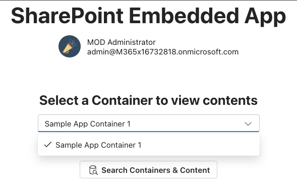

Now that you're listing Container, let's add the code to create a Container!

Before continuing, stop the running processes by pressing <kbd>CTRL</kbd>+<kbd>C</kbd> in the console windows.

## Create SPE Containers

Just like listing Containers, before we can update our client-side application, we need to create a server-side process to authenticate and create the Container using the OBO token. Our client-side application will then call our server-side API that will create the SPE Container.

### Create a new `/createContainer` endpoint on the REST API server

Create a new file, **./server/createContainer.ts**, and add the following code to it. This looks similar to our **listContainers.ts** endpoint:

```typescript
import {
  Request,
  Response
} from "restify";
import * as MSAL from "@azure/msal-node";
import 'isomorphic-fetch';
import * as MSGraph from '@microsoft/microsoft-graph-client';
import { getGraphToken } from "./common/auth";
import { msalConfig } from "./common/config";

const confidentialClient = new MSAL.ConfidentialClientApplication(msalConfig);

export const createContainer = async (req: Request, res: Response) => {

  if (!req.headers.authorization) {
    res.send(401, { message: 'No access token provided.' });
    return;
  }

  const [bearer, token] = req.headers.authorization.split(' ');

  // TODO - validate request

  const [graphSuccess, graphTokenRequest] = await getGraphToken(confidentialClient, token);
  if (!graphSuccess) {
    res.send(200, graphTokenRequest);
    return;
  }

  const authProvider = (callback: MSGraph.AuthProviderCallback) => {
    callback(null, graphTokenRequest);
  };
}
```

When creating a Container, the client-side app will submit a payload that includes the name of the Container and an optional description. Replace the `TODO - validate request` comment with the following code to ensure the new Container's `displayName` is provided in the `createContainer()` method:

```typescript
if (!req.body?.displayName) {
  res.send(400, { message: 'Invalid request: must provide a displayName property in the query parameters or request body' });
  return undefined;
}
```

Next, add the following code to the end of the `createContainer()` method to create a Microsoft Graph client instance to submit a request to create the Container:

```typescript
try {
  const graphClient = MSGraph.Client.init({
    authProvider: authProvider,
    defaultVersion: 'beta'
  });

  const containerRequestData = {
    displayName: req.body!.displayName,
    description: (req.body?.description) ? req.body.description : '',
    containerTypeId: process.env["CONTAINER_TYPE_ID"]
  };

  const graphResponse = await graphClient.api(`storage/fileStorage/containers`)
                                         .post(containerRequestData);

  res.send(200, graphResponse);
  return;
} catch (error: any) {
  res.send(500, { message: `Failed to create container: ${error.message}` });
  return;
}
```

The last step is to wire the `createContainer` object to the API server.

Locate and open the **./server/index.ts** file.

Add the following `import` statement immediately after the existing `import` statements:

```typescript
import { createContainer } from "./createContainer";
```

Next, add the following code ot the end of the file to map the `createContainer` handler to HTTP GET requests on our API server:

```typescript
server.post('/api/createContainer', async (req, res, next) => {
  try {
    const response = await createContainer(req, res);
    res.send(200, response)
  } catch (error: any) {
    res.send(500, { message: `Error in API server: ${error.message}` });
  }
  next();
});
```

Check your work by building the server-side API project. Do this by running the following command at the root of the project:

```console
npm run build:backend
```

With the server-side API part complete, you can now update the client-side React application.

### Update the client-side app to create an SPE Container

Locate and open the SPE service you previously created: **./src/services/spembedded.ts** and add the following method to it. This will submit an HTTP POST with the payload of the new Container details passed into the method as arguments. The response from our server-side API server will contain the Container that was created:

```typescript
async createContainer(containerName: string, containerDescription: string = ''): Promise<IContainer | undefined> {
  const api_endpoint = `${Config.API_SERVER_URL}/api/createContainer`;

  if (Providers.globalProvider.state === ProviderState.SignedIn) {
    const token = await this.getApiAccessToken();
    const requestHeaders = {
      'Authorization': `Bearer ${token}`,
      'Content-Type': 'application/json'
    };

    const requestData = {
      displayName: containerName,
      description: containerDescription
    };
    const requestOptions = {
      method: 'POST',
      headers: requestHeaders,
      body: JSON.stringify(requestData)
    };

    const response = await fetch(api_endpoint, requestOptions);

    if (response.ok) {
      const containerResponse = await response.json();
      return containerResponse as IContainer;
    } else {
      console.error(`Unable to create container: ${JSON.stringify(response)}`);
      return undefined;
    }
  }
};
```

Finally update the React **Containers** component.

Locate and open the **./src/components/Containers.tsx** file. Within this file, locate the following two lines in the handler `onCreateContainer()`:

```typescript
await new Promise(resolve => setTimeout(resolve, 1000));
setSelectedContainer((await MOCKS.getContainers())[0]);
```

... replace these lines with the following code. This will create a new Container using our SPE service and add the returned Container to the existing collection of Containers:

```typescript
const newContainer = await spe.createContainer(containerName, containerDescription);

if (newContainer) {
  setContainers(current => [...current, newContainer]);
  setSelectedContainer(newContainer);
}
```

### Test creating an SPE Container

In the previous test, you used different NPM scripts to start the API server & client-side application. From this point forward, you can use another NPM script to do everything at once.

Run the following command:

```console
npm start
```

This will first build the API server codebase (`npm run build:backend`) and then start both projects (`npm run start:apps`). The `start:apps` script starts both web servers in parallel using the npm package [npm-run-all](https://www.npmjs.com/package/npm-run-all).

After building & starting the application, the process will launch your default browser and navigate to the root of our React SPA.

When the app loads, once the current user has signed in, the **Containers** component will be shown. Select the **Create a new storage Container** button to launch the dialog:

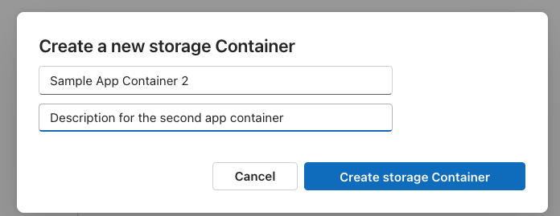

Complete the form by entering a name and description for the Container. When finished, select the **Create storage Container** button to create a new Container.

Once the Container has been created and our API server has responded, the dialog will close and you should see the new Container in the selector:

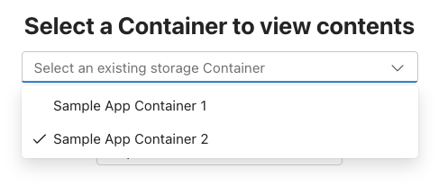

Before continuing, stop the running processes by pressing <kbd>CTRL</kbd>+<kbd>C</kbd> in the console.

## Manage Container permissions

Now that you can list and create Containers, let's add some Container management functionality to the app. In this section, you'll add the ability to manage the permissions on the currently selected Container.

### Update API server with Container permission management endpoints

To start, create a new API endpoint to list all Container permissions. Add a new file, **./server/listContainerPermissions.ts** and add the following code to it. This uses the Container's `/permissions` endpoint. Notice this code also checks that a Container ID is specified as a URL parameter in the request:

```typescript
import {
  Request,
  Response
} from "restify";
import * as MSAL from "@azure/msal-node";
import 'isomorphic-fetch';
import * as MSGraph from '@microsoft/microsoft-graph-client';
import { getGraphToken,  } from "./common/auth";
import { msalConfig } from "./common/config";

const confidentialClient = new MSAL.ConfidentialClientApplication(msalConfig);

export const listContainerPermissions = async (req: Request, res: Response) => {

  if (!req.headers.authorization) {
    res.send(401, { message: 'No access token provided.' });
    return;
  }
  if (!req.params.id) {
    res.send(400, { message: 'No container ID provided.' });
    return;
  }

  const [bearer, token] = req.headers.authorization.split(' ');
  const [graphSuccess, graphTokenRequest] = await getGraphToken(confidentialClient, token);

  if (!graphSuccess) {
    res.send(200, graphTokenRequest);
    return;
  }

  const authProvider = (callback: MSGraph.AuthProviderCallback) => {
    callback(null, graphTokenRequest);
  };

  try {
    const graphClient = MSGraph.Client.init({
      authProvider: authProvider,
      defaultVersion: 'beta'
    });

    const graphResponse = await graphClient.api(`storage/fileStorage/containers/${req.params.id}/permissions`)
                                           .get();

    res.send(200, graphResponse);
    return;
  } catch (error: any) {
    res.send(500, { message: `Unable to list container permissions: ${error.message}` });
    return;
  }
}
```

Next, create a new API endpoint to create a new Container permission by submitting an HTTP POST to the Container's `/permissions` endpoint. Add a new file, **./server/createContainerPermission.ts** and add the following code to it:

```typescript
import {
  Request,
  Response
} from "restify";
import * as MSAL from "@azure/msal-node";
import 'isomorphic-fetch';
import * as MSGraph from '@microsoft/microsoft-graph-client';
import { getGraphToken,  } from "./common/auth";
import { msalConfig } from "./common/config";

const confidentialClient = new MSAL.ConfidentialClientApplication(msalConfig);

export const createContainerPermission = async (req: Request, res: Response) => {

  if (!req.headers.authorization) {
    res.send(401, { message: 'No access token provided.' });
    return;
  }
  if (!req.params.id) {
    res.send(400, { message: 'No container ID provided.' });
    return;
  }
  if (!req.body?.role) {
    res.send(400, { message: 'Invalid request: must provide role property request body' });
    return undefined;
  }
  if (!req.body?.userPrincipalName) {
    res.send(400, { message: 'Invalid request: must provide userPrincipalName property request body' });
    return undefined;
  }

  const [bearer, token] = req.headers.authorization.split(' ');
  const [graphSuccess, graphTokenRequest] = await getGraphToken(confidentialClient, token);

  if (!graphSuccess) {
    res.send(200, graphTokenRequest);
    return;
  }

  const authProvider = (callback: MSGraph.AuthProviderCallback) => {
    callback(null, graphTokenRequest);
  };

  try {
    const graphClient = MSGraph.Client.init({
      authProvider: authProvider,
      defaultVersion: 'beta'
    });

    const requestBody = {
      roles: [`${req.body!.role}`],
      grantedToV2: {
        user: {
          userPrincipalName: `${req.body!.userPrincipalName}`
        }
      }
    };

    const graphResponse = await graphClient.api(`storage/fileStorage/containers/${req.params.id}/permissions`)
                                           .post(requestBody);

    res.send(200, graphResponse);
    return;
  } catch (error: any) {
    res.send(500, { message: `Unable to add container permissions: ${error.message}` });
    return;
  }
}
```

Next, create a new API endpoint to delete a new Container permission by submitting an HTTP DELETE to the specific permission endpoint. Add a new file, **./server/deleteContainerPermission.ts** and add the following code to it:

```typescript
import {
  Request,
  Response
} from "restify";
import * as MSAL from "@azure/msal-node";
import 'isomorphic-fetch';
import * as MSGraph from '@microsoft/microsoft-graph-client';
import { getGraphToken, } from "./common/auth";
import { msalConfig } from "./common/config";

const confidentialClient = new MSAL.ConfidentialClientApplication(msalConfig);

export const deleteContainerPermission = async (req: Request, res: Response) => {

  if (!req.headers.authorization) {
    res.send(401, { message: 'No access token provided.' });
    return;
  }
  if (!req.params.id) {
    res.send(400, { message: 'No container ID provided.' });
    return;
  }
  if (!req.body?.permissionId) {
    res.send(400, { message: 'Invalid request: must provide permissionId property request body' });
    return undefined;
  }

  const [bearer, token] = req.headers.authorization.split(' ');
  const [graphSuccess, graphTokenRequest] = await getGraphToken(confidentialClient, token);

  if (!graphSuccess) {
    res.send(200, graphTokenRequest);
    return;
  }

  const authProvider = (callback: MSGraph.AuthProviderCallback) => {
    callback(null, graphTokenRequest);
  };

  try {
    const graphClient = MSGraph.Client.init({
      authProvider: authProvider,
      defaultVersion: 'beta'
    });

    const graphResponse = await graphClient.api(`storage/fileStorage/containers/${req.params.id}/permissions/${req.body.permissionId}`)
                                           .delete();

    res.send(200, graphResponse);
    return;
  } catch (error: any) {
    res.send(500, { message: `Unable to delete container permissions: ${error.message}` });
    return;
  }
}
```

With the permission handlers created, you now need to expose them in the API server.

Locate and open the **./server/index.ts** file and add the following `import` statements after the existing ones:

```typescript
import { listContainerPermissions } from "./listContainerPermissions";
import { createContainerPermission } from "./createContainerPermission";
import { deleteContainerPermission } from "./deleteContainerPermission";
```

Next, add the following handlers to the end of the file to link the endpoints to the handlers:

```typescript
server.get('/api/listContainerPermissions/:id', async (req, res, next) => {
  try {
    const response = await listContainerPermissions(req, res);
    res.send(200, response)
  } catch (error: any) {
    res.send(500, { message: `Error in API server: ${error.message}` });
  }
  next();
});

server.post('/api/createContainerPermission/:id', async (req, res, next) => {
  try {
    const response = await createContainerPermission(req, res);
    res.send(200, response)
  } catch (error: any) {
    res.send(500, { message: `Error in API server: ${error.message}` });
  }
  next();
});

server.post('/api/deleteContainerPermission/:id', async (req, res, next) => {
  try {
    const response = await deleteContainerPermission(req, res);
    res.send(200, response)
  } catch (error: any) {
    res.send(500, { message: `Error in API server: ${error.message}` });
  }
  next();
});
```

Now that the API server has been updated, you can update your client-side application.

### Update the client-site app with Container permission management

Start by updating the SPE service that will call the three new endpoints to get a list of all permissions on the Container as well as create and delete permissions.

Locate and open the file **./src/services/spembedded.ts**.

Add the following code to the `SpEmbedded` class to get a list of all Container permissions:

```typescript
async listContainerPermissions(containerId: string): Promise<IContainerPermission[] | undefined> {
  const api_endpoint = `${Config.API_SERVER_URL}/api/listContainerPermissions/${containerId}`;

  if (Providers.globalProvider.state === ProviderState.SignedIn) {
    const token = await this.getApiAccessToken();
    const requestHeaders = {
      'Authorization': `Bearer ${token}`,
      'Content-Type': 'application/json'
    };
    const requestOptions = {
      method: 'GET',
      headers: requestHeaders
    };
    const response = await fetch(api_endpoint, requestOptions);

    if (response.ok) {
      const containerResponse = await response.json();
      return (containerResponse.value)
        ? containerResponse.value.map((permission: any) => {
          return {
            id: permission.id,
            roles: permission.roles,
            user: {
              displayName: permission.grantedToV2.user.displayName,
              email: permission.grantedToV2.user.email,
              userPrincipalName: permission.grantedToV2.user.userPrincipalName
            }
          }
        }) as IContainerPermission[]
        : undefined;
    } else {
      console.error(`Unable to list container permissions: ${JSON.stringify(response)}`);
      return undefined;
    }
  }
};
```

Add the following code to the `SpEmbedded` class to create a new Container permission:

```typescript
async createContainerPermission(containerId: string, role: string, userPrincipalName: string): Promise<IContainerPermission | undefined> {
  const api_endpoint = `${Config.API_SERVER_URL}/api/createContainerPermission/${containerId}`;

  if (Providers.globalProvider.state === ProviderState.SignedIn) {
    const token = await this.getApiAccessToken();
    const requestHeaders = {
      'Authorization': `Bearer ${token}`,
      'Content-Type': 'application/json'
    };

    const requestData = { role, userPrincipalName };
    const requestOptions = {
      method: 'POST',
      headers: requestHeaders,
      body: JSON.stringify(requestData)
    };
    const response = await fetch(api_endpoint, requestOptions);

    if (response.ok) {
      const containerResponse = await response.json();
      return {
        id: containerResponse.id,
        roles: containerResponse.roles,
        user: {
          displayName: containerResponse.grantedToV2.user.displayName,
          email: containerResponse.grantedToV2.user.email,
          userPrincipalName: containerResponse.grantedToV2.user.userPrincipalName
        }
      }
    } else {
      console.error(`Unable to create container permission: ${JSON.stringify(response)}`);
      return undefined;
    }
  }
};
```

Add the following code to the `SpEmbedded` class to create a delete an existing Container permission:

```typescript
async deleteContainerPermission(containerId: string, permissionId: string): Promise<void> {
  const api_endpoint = `${Config.API_SERVER_URL}/api/deleteContainerPermission/${containerId}`;

  if (Providers.globalProvider.state === ProviderState.SignedIn) {
    const token = await this.getApiAccessToken();
    const requestHeaders = {
      'Authorization': `Bearer ${token}`,
      'Content-Type': 'application/json'
    };

    const requestData = { permissionId };
    const requestOptions = {
      method: 'POST',
      headers: requestHeaders,
      body: JSON.stringify(requestData)
    };
    const response = await fetch(api_endpoint, requestOptions);

    if (response.ok) {
      return;
    } else {
      console.error(`Unable to delete container permission: ${JSON.stringify(response)}`);
      return;
    }
  }
};
```

Now that the SPE service has been updated, the last step is to update the React application.

### Update React App with Container permission management

Locate and open the dialog component **./src/components/dialogs/ContainerPermissions.tsx**.

Not only will we update the dialog to support adding permissions, but we're also going to use the MGT **PeoplePicker** control to simplify picking users from our organization.

Add the following `import` statements after the existing `import` statements:

```typescript
import {
  IUser,
  PeoplePicker,
} from "@microsoft/mgt-react";

import SpEmbedded from '../../services/spembedded';
const spe = new SpEmbedded();
```

Start by adding a new React state variable to track the currently selected user in the MGT **PeoplePicker** control. Add the following with the existing `useState()` statements at the top of the component:

```typescript
const [selectedUser, setSelectedUser] = useState<IUser | undefined>(undefined);
```

Next, update the `resetForm()` method to reset the selected user on the **PeoplePicker** control:

```typescript
const resetForm = () => {
  setSelectedUser(undefined);    // <<< add this line
  setNewPermissionRole('');
};
```

Implement the **PeoplePicker** by replacing the existing `<Tag />` control in the component's `return()` statement with the following code:

```tsx
<PeoplePicker
  placeholder='Select a person'
  disabled={isAdding || isDeleting}
  type='person'
  userType='user'
  selectionMode='single'
  showMax={5}
  selectionChanged={(event) => { setSelectedUser(event.detail[0]); }} />
```

With the visual aspect of the dialog updated, replace the handlers that use our faked data with real permissions. Let's start with getting all the Container's permissions.

Locate the `loadItems` method and replace the the following line:

```typescript
const containerPermissions = await MOCKS.getContainerPermissions(props.containerId);
```

... with the following line to use get Container permissions using our service:

```typescript
const containerPermissions = await spe.listContainerPermissions(props.containerId);
```

Now let's add the ability to create new permissions. Locate the `onAddPermission()` method and replace the following code:

```typescript
await new Promise(resolve => setTimeout(resolve, 750));

setContainerPermissions([...containerPermissions, {
  id: "permission-4",
  roles: [newPermissionRole],
  user: {
    displayName: "Della Dennis",
    email: "dellad@contoso.onmicrosoft.com",
    userPrincipalName: "dellad@contoso.onmicrosoft.com"
  }
}]);
```

... with the following lines:

```typescript
await spe.createContainerPermission(props.containerId, newPermissionRole, selectedUser!.userPrincipalName as string);
await loadItems();
```

And finally, let's add the ability to delete a permission. Locate the `onDeletePermission()` method and replace the following code:

```typescript
await new Promise(resolve => setTimeout(resolve, 750));

const newContainerPermissions = containerPermissions.slice(0, containerPermissions.length - 1);
setContainerPermissions(newContainerPermissions);
```

... with the following lines:

```typescript
await spe.deleteContainerPermission(props.containerId, permission.id as string);
await loadItems();
```

### Test Container permission management

Let's test our changes to the apps. Run the following command to build and start both the API server and client-side app server:

```console
npm start
```

After building & starting the application, the process will launch your default browser and navigate to the root of our React SPA.

> [!NOTE]
> The MGT **PeoplePicker** control may require the signed in user to grant additional scopes. When the browser loads, you might be directed to consent additional permission requests. If so, select the checkbox to **Consent on behalf of your organization** so other users won't have to go through the consent process. Finally, select the **Accept** button:
>
> 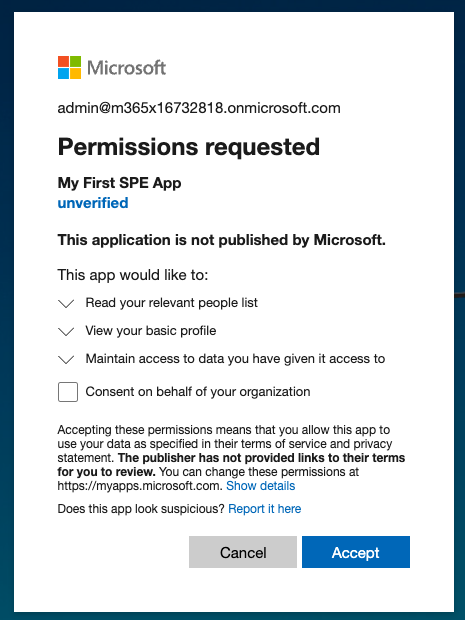

Select one of the existing Containers from the selector, and then select the **Permissions** button on the toolbar. Use the form in the dialog to select a user from your organization, select a permission role, and then select the **Add** button.

After a moment, you'll see the permission added to the Container.

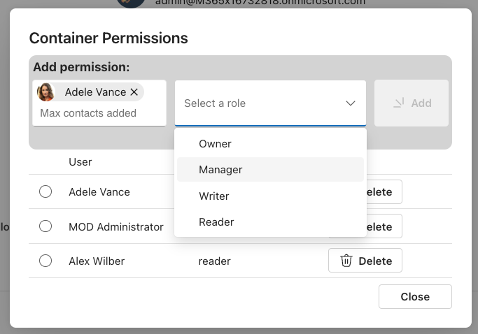

Next, test the delete functionality by selecting the **Delete** button next to one of the permissions.

Before continuing, stop the running processes by pressing <kbd>CTRL</kbd>+<kbd>C</kbd> in the console.

## Manage Container custom properties

SPE Containers support custom properties by adding name-value pairs to the Container. In this section, you'll add the ability to list and add custom properties to a Container.

### Update API server with Container custom property management

To start, create a new API endpoint to list all Container properties. Add a new file, **./server/listContainerProperties.ts** and add the following code to it. This uses the Container's `/customProperties` endpoint:

```typescript
import {
  Request,
  Response
} from "restify";
import * as MSAL from "@azure/msal-node";
import 'isomorphic-fetch';
import * as MSGraph from '@microsoft/microsoft-graph-client';
import { getGraphToken,  } from "./common/auth";
import { msalConfig } from "./common/config";

const confidentialClient = new MSAL.ConfidentialClientApplication(msalConfig);

export const listContainerProperties = async (req: Request, res: Response) => {

  if (!req.headers.authorization) {
    res.send(401, { message: 'No access token provided.' });
    return;
  }
  if (!req.params.id) {
    res.send(400, { message: 'No container ID provided.' });
    return;
  }

  const [bearer, token] = req.headers.authorization.split(' ');
  const [graphSuccess, graphTokenRequest] = await getGraphToken(confidentialClient, token);

  if (!graphSuccess) {
    res.send(200, graphTokenRequest);
    return;
  }

  const authProvider = (callback: MSGraph.AuthProviderCallback) => {
    callback(null, graphTokenRequest);
  };

  try {
    const graphClient = MSGraph.Client.init({
      authProvider: authProvider,
      defaultVersion: 'beta'
    });

    const graphResponse = await graphClient.api(`storage/fileStorage/containers/${req.params.id}/customProperties`)
                                           .get();

    res.send(200, graphResponse);
    return;
  } catch (error: any) {
    res.send(500, { message: `Unable to list container properties: ${error.message}` });
    return;
  }
}
```

Next, add an endpoint to create a custom property. Add a new file **./server/createContainerProperty.ts** and add the following code to it:

```typescript
import {
  Request,
  Response
} from "restify";
import * as MSAL from "@azure/msal-node";
import 'isomorphic-fetch';
import * as MSGraph from '@microsoft/microsoft-graph-client';
import { getGraphToken, } from "./common/auth";
import { msalConfig } from "./common/config";

const confidentialClient = new MSAL.ConfidentialClientApplication(msalConfig);

export const createContainerProperty = async (req: Request, res: Response) => {

  if (!req.headers.authorization) {
    res.send(401, { message: 'No access token provided.' });
    return;
  }
  if (!req.params.id) {
    res.send(400, { message: 'No container ID provided.' });
    return;
  }
  if (!req.body?.propertyName) {
    res.send(400, { message: 'Invalid request: must provide propertyName property request body' });
    return undefined;
  }
  if (!req.body?.propertyValue) {
    res.send(400, { message: 'Invalid request: must provide propertyValue property request body' });
    return undefined;
  }
  if (!req.body?.isSearchable) {
    res.send(400, { message: 'Invalid request: must provide isSearchable property request body' });
    return undefined;
  }

  const [bearer, token] = req.headers.authorization.split(' ');
  const [graphSuccess, graphTokenRequest] = await getGraphToken(confidentialClient, token);

  if (!graphSuccess) {
    res.send(200, graphTokenRequest);
    return;
  }

  const authProvider = (callback: MSGraph.AuthProviderCallback) => {
    callback(null, graphTokenRequest);
  };

  try {
    const graphClient = MSGraph.Client.init({
      authProvider: authProvider,
      defaultVersion: 'beta'
    });

    const graphResponse = await graphClient.api(`storage/fileStorage/containers/${req.params.id}/customProperties`)
                                           .patch(req.body)

    res.send(200, graphResponse);
    return;
  } catch (error: any) {
    res.send(500, { message: `Unable to create container property: ${error.message}` });
    return;
  }
}
```

With the custom property handlers created, you now need to expose them in the API server.

Locate and open the **./server/index.ts** file and add the following `import` statements after the existing ones:

```typescript
import { listContainerProperties } from "./listContainerProperties";
import { createContainerProperty } from "./createContainerProperty";
```

Next, add the following handlers to the end of the file to link the endpoints to the handlers:

```typescript
server.get('/api/listContainerProperties/:id', async (req, res, next) => {
  try {
    const response = await listContainerProperties(req, res);
    res.send(200, response)
  } catch (error: any) {
    res.send(500, { message: `Error in API server: ${error.message}` });
  }
  next();
});

server.post('/api/createContainerProperty/:id', async (req, res, next) => {
  try {
    const response = await createContainerProperty(req, res);
    res.send(200, response)
  } catch (error: any) {
    res.send(500, { message: `Error in API server: ${error.message}` });
  }
  next();
});
```

Now that the API server has been updated, you can update your client-side application.

### Update the client-site app with Container permission management

Start by updating the SPE service that will call the two new endpoints to get a list of all custom properties on the Container as well as create a new custom property.

Locate and open the file **./src/services/spembedded.ts**.

Add the following code to the `SpEmbedded` class to get a list of all Container custom properties:

```typescript
async listContainerProperties(containerId: string): Promise<IContainerProperty[] | undefined> {
  const api_endpoint = `${Config.API_SERVER_URL}/api/listContainerProperties/${containerId}`;

  if (Providers.globalProvider.state === ProviderState.SignedIn) {
    const token = await this.getApiAccessToken();
    const requestHeaders = {
      'Authorization': `Bearer ${token}`,
      'Content-Type': 'application/json'
    };
    const requestOptions = {
      method: 'GET',
      headers: requestHeaders
    };

    const response = await fetch(api_endpoint, requestOptions);
    if (response.ok) {
      const containerResponse = await response.json();
      const containerProperties: IContainerProperty[] = [];
      Object.entries(containerResponse).forEach(([key, value]) => {
        if (key !== '@odata.context')
          containerProperties.push({
            propertyName: key,
            propertyValue: containerResponse[key].value,
            isSearchable: containerResponse[key].isSearchable
          });
      });
      return containerProperties;
    } else {
      console.error(`Unable to list container properties: ${JSON.stringify(response)}`);
      return undefined;
    }
  }
};
```

Add the following code to the `SpEmbedded` class to create a new Container custom property:

```typescript
async createContainerProperty(containerId: string, propertyName: string, propertyValue: string, isSearchable: boolean): Promise<void> {
  const api_endpoint = `${Config.API_SERVER_URL}/api/createContainerProperty/${containerId}`;

  if (Providers.globalProvider.state === ProviderState.SignedIn) {
    const token = await this.getApiAccessToken();
    const requestHeaders = {
      'Authorization': `Bearer ${token}`,
      'Content-Type': 'application/json'
    };

    const requestData = {
      [propertyName]: {
        value: propertyValue,
        isSearchable: true === isSearchable
      }
    };

    const requestOptions = {
      method: 'POST',
      headers: requestHeaders,
      body: JSON.stringify(requestData)
    };
    const response = await fetch(api_endpoint, requestOptions);

    if (response.ok) {
      return;
    } else {
      console.error(`Unable to create container property: ${JSON.stringify(response)}`);
      return;
    }
  }
};
```

Now that the SPE service has been updated, the last step is to update the React application.

### Update React App with Container custom property management

Locate and open the dialog component **./src/components/dialogs/ContainerProperties.tsx**.

Add the following `import` statements after the existing `import` statements:

```typescript
import SpEmbedded from '../../services/spembedded';
const spe = new SpEmbedded();
```

Locate the `loadItems` method and replace the the following line:

```typescript
const containerProperties = await MOCKS.getContainerProperties(props.containerId);
```

... with the following line:

```typescript
const containerProperties = await spe.listContainerProperties(props.containerId);
```

Next, update the `onAddProperty()` method. Locate the following line and remove it:

```typescript
await new Promise(resolve => setTimeout(resolve, 750));
```

Locate the following code immediately after the `isChecked` constant is set with the ternary expression:

```typescript
setContainerProperties([...containerProperties, {
  propertyName: newPropertyName,
  propertyValue: newPropertyValue,
  isSearchable: isChecked
}]);
```

... and replace it with the following:

```typescript
await spe.createContainerProperty(props.containerId, newPropertyName, newPropertyValue, isChecked);
await loadItems();
```

### Test Container custom property management

Let's test our changes. Run the following command to build and start both the API server and client-side app server:

```console
npm start
```

After building & starting the application, the process will launch your default browser and navigate to the root of our React SPA.

Select one of the existing Containers from the selector, and then select the **Properties** button on the toolbar.

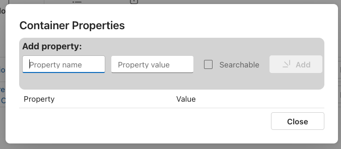

Use the form in the dialog to select a user from your organization, select a permission role, and then select the **Add** button.

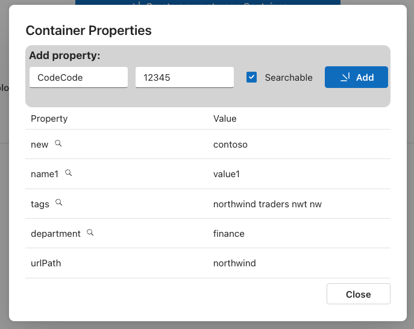

Notice custom properties can be flagged as being searchable or not. In the dialog, searchable properties are indicated with the magnifying glass at the end of the property's name.

Before continuing, stop the running processes by pressing <kbd>CTRL</kbd>+<kbd>C</kbd> in the console.

## Working with files and folders in Containers

So far this lab has focused on Container management tasks. Now let's see how we can work with the contents within the Containers.

These operations can be performed without needing to use the intermediary API server because you're simply working with Microsoft Graph `DriveItems`. The `drives` and `driveItems` endpoints don't require OBO access tokens, so our React app can submit the calls directly to Microsoft Graph.

### Upload files to Containers

Locate the **Container** component in the **./src/components/Container.tsx** file. Add the following `import` statement after the existing `import` statements:

```typescript
import { Providers } from "@microsoft/mgt-element";
```

Next locate the `onUploadFileSelected()` method and replace the contents of it with the following code. This will get the file from the event passed into the handler and then read the contents into memory using a **FileReader** object. The code then attaches to two events, the `loaded` and `error` events. When the file has been `loaded` into memory, use the Microsoft Graph JavaScript client to write the file to the current Container using an HTTP PUT operation to the Microsoft Graph:

```typescript
const file = event.target.files![0];
const fileReader = new FileReader();
fileReader.readAsArrayBuffer(file);
fileReader.addEventListener('loadend', async (event: any) => {
  const graphClient = Providers.globalProvider.graph.client;
  const endpoint = `/drives/${props.container.id}/items/${folderId || 'root'}:/${file.name}:/content`;

  graphClient.api(endpoint).putStream(fileReader.result)
    .then(async (response) => {
      await loadItems(folderId || 'root');
    })
    .catch((error) => {
      console.error(`Failed to upload file ${file.name}: ${error.message}`);
    });
});

fileReader.addEventListener('error', (event: any) => {
  console.error(`Error on reading file: ${event.message}`);
});
```

### Create a folder in a Container

Locate the method `onCreateFolder()` and replace the following line:

```typescript
await new Promise(resolve => setTimeout(resolve, 750));
```

... with the following code:

```typescript
const currentFolderId = folderId;
const graphClient = Providers.globalProvider.graph.client;
const requestBody = {
  "name": folderName,
  "folder": {},
  "@microsoft.graph.conflictBehavior": "rename"
};
await graphClient.api(`/drives/${props.container.id}/items/${currentFolderId}/children`)
                 .post(requestBody);

await loadItems(currentFolderId);
```

### Listing the contents of a Container

Now that you've added the code to upload files and create folders in Containers, let's add the code to list the contents of the Container.

Locate the following line in the `loadItems()` method:

```typescript
const driveId = props.container.id;
```

... and replace it with the following:

```typescript
const graphClient = Providers.globalProvider.graph.client;
const driveId = props.container.id;
const driveItemId = itemId || 'root';
```

Next, locate the following line in the same `loadItems()` method:

```typescript
const containerItems: DriveItem[] = await MOCKS.getFiles(driveId);
```

... and replace it with the following:

```typescript
const graphResponse = await graphClient.api(`/drives/${driveId}/items/${driveItemId}/children`)
                                       .get();
const containerItems: DriveItem[] = graphResponse.value as DriveItem[];
```

### Test working with files and folders in Containers

Let's test our changes. Run the following command to build and start both the API server and client-side app server:

```console
npm start
```

After building & starting the application, the process will launch your default browser and navigate to the root of our React SPA.

Select one of the existing Containers from the dropdown selector. The contents of the container are shown in the list below the toolbar. Start by uploading a new files to the container - select the **Upload File** button in the toolbar. Select a file to upload.

> [!TIP]
> Sample file content has been provided in the [sample-content](../sample-content/) folder.

Once the file has been uploaded, the app will refresh to show the contents of the Container.

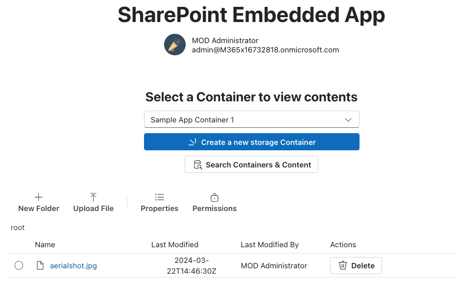

Next, create a new folder by selecting the **New Folder** button in the toolbar. Enter a name for the new folder and select **Create Folder**.

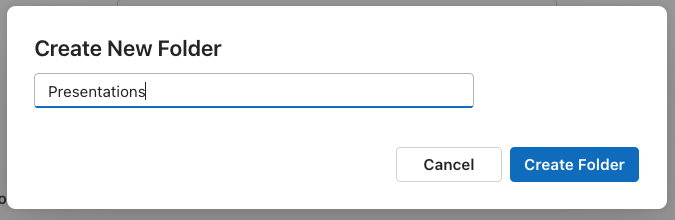

Once the folder has been created, the app will refresh to show the folder in the Container.

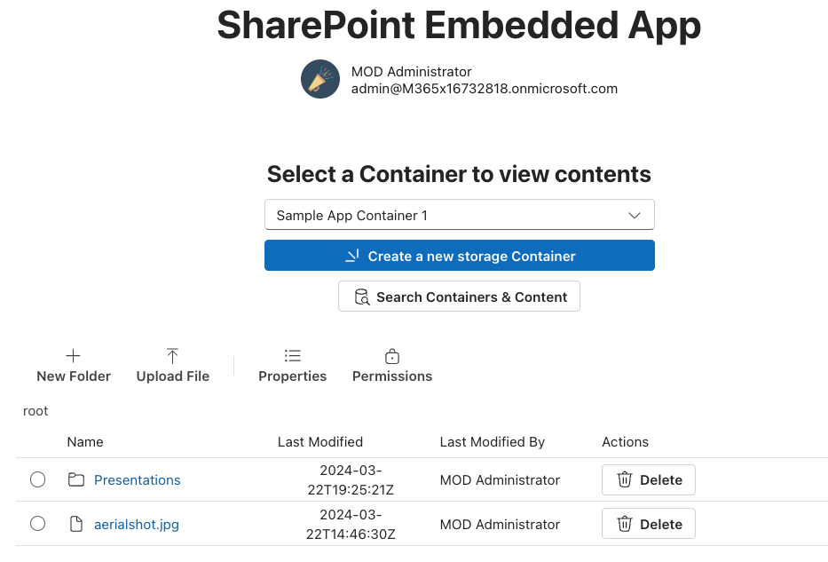

Select the folder and upload a few files to it. Notice how the folder is listed in the breadcrumb navigation between the list of files and the Toolbar.

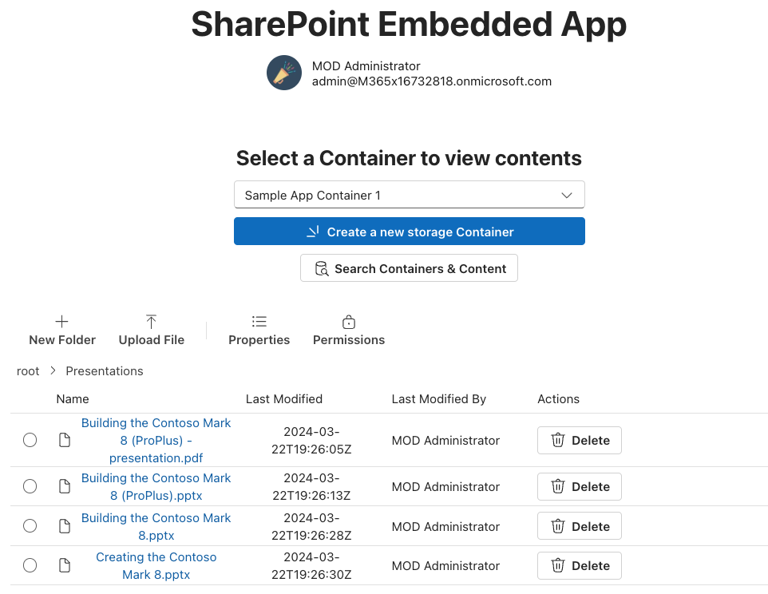

Before continuing, stop the running processes by pressing <kbd>CTRL</kbd>+<kbd>C</kbd> in the console.

## Add search for content and Containers

The last step to perform is to implement the ability to search for content and Containers in your SPE partition. For this scenario, you'll implement two different search experiences: search for Containers in your SPE partition and search for content within a specific Container.

The React app is configured so that if you select the **Search Containers & Content** button when no container is selected, it defaults to searching for Containers by name or property. Otherwise, if you've selected a Container, it will default to searching the contents within the Container.

Start by locating and opening the **./src/components/dialogs/Search.tsx** file. Add the following `import` statement after the existing `import` statements:

```typescript
import { Providers } from "@microsoft/mgt-element";
```

Next, locate and remove the following line in the `executeSearch()` method:

```typescript
await new Promise(resolve => setTimeout(resolve, 750));
```

Now, locate the `if-else` statement that starts with the following line and remove the entire block:

```typescript
if (modeSearchContainer) {
```

Replace it with the following code that will first create an array of `queryParameters` to use as filters depending on the current mode of the search dialog (ie: Container mode or Files mode). It then creates a request body to submit to the Microsoft Graph `/search/query` endpoint. After submitting the query, the are converted to an array of search results that are bound to the **DataGrid** control in the dialog:

```typescript
const queryParameters: string[] = [];
if (modeSearchContainer) {
  queryParameters.push(`ContainerTypeId:${Config.CONTAINER_TYPE_ID}`);
  if (filterTitle) {
    queryParameters.push(`Title:'${filterTitle}'`);
  }
  if (filterDescription) {
    queryParameters.push(`Description:'${filterDescription}'`);
  }
  if (filterPropertyName && filterPropertyValue) {
    queryParameters.push(`${filterPropertyName}:'${filterPropertyValue}'`);
  }
} else {
  queryParameters.push(`ContainerId:${props.filterByContainerId}`);
  if (filterTitle) {
    queryParameters.push(`Title:'${filterTitle}'`);
  }
  if (filterDescription) {
    queryParameters.push(`'${filterContent}'`);
  }
  if (selectedFileMediaType.id) {
    queryParameters.push(`FileType:${selectedFileMediaType.id}`);
  }
}

const requestBody = {
  requests: [
    {
      entityTypes: [(modeSearchContainer) ? 'drive' : 'driveItem'],
      query: {
        query_string: {
          query: queryParameters.join(' AND ')
        }
      }
    }
  ]
};
const graphClient = Providers.globalProvider.graph.client;
const graphResponse = await graphClient.api(`/search/query`)
                                       .version('beta')
                                       .post(requestBody);

const results: ISearchResult[] = [];
graphResponse.value[0].hitsContainers[0]?.hits?.forEach((searchResult: any) => {
  const result = searchResult._source;
  results.push({
    id: result.id,
    isContainer: modeSearchContainer,
    displayName: result.name,
    downloadUrl: '',
    webUrl: result.webUrl
  });
});
setSearchResults(results);
```

### Test the search dialog

Let's test our changes. Run the following command to build and start both the API server and client-side app server:

```console
npm start
```

After building & starting the application, the process will launch your default browser and navigate to the root of our React SPA.

Don't select a Container, but select the **Search Containers and Content** button to open the search dialog in *Container* mode. Enter a word found in one of your existing Containers and select the **Search** button.

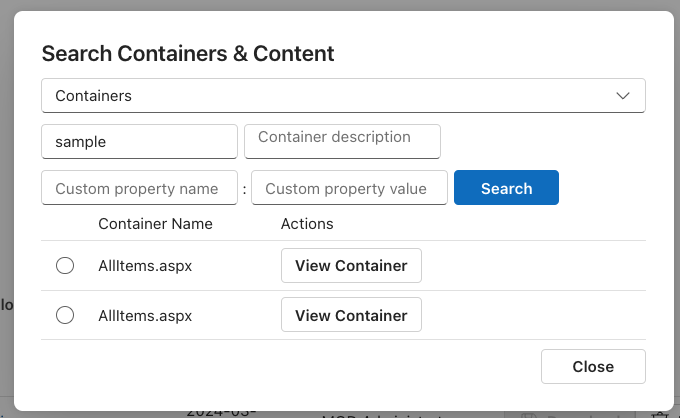

> [!NOTE]
> At the present time, the name of the Container is not returned in the response. The `name` property instead currently returns the name of the page for the default view on the Container, *AllItems.aspx*.

If you select one of the **View Container** buttons, it will close the search dialog, and show the contents of the Container in the main app's UX.

Now, select a Container that contains some files, and then select the **Search Containers and Content** button. This time, while in the *Files* mode, use the file type selector to filter on a specific file type, such as PowerPoint presentations.

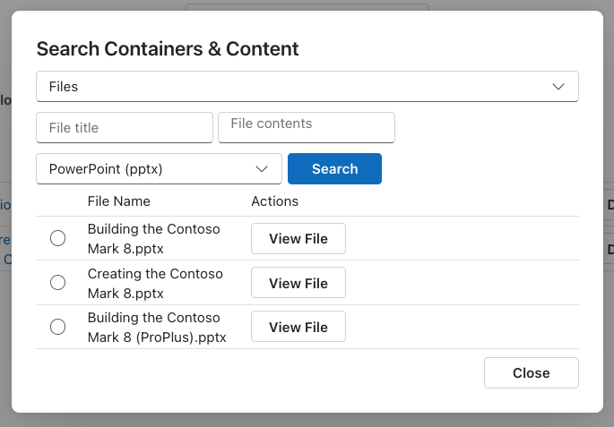

Before continuing, stop the running processes by pressing <kbd>CTRL</kbd>+<kbd>C</kbd> in the console.

## Summary

In this hands-on lab, you added core functionality to your first SharePoint Embedded (SPE) application. You first updated the app with the necessary credentials and IDs you collected in the previous lab. You then converted the app from using fake data reading and writing real data to your SPE partition, including:

- [Add support for user login to the client-side app](#add-support-for-user-login-to-the-client-side-app)
- [List all SPE Containers](#list-all-spe-containers)
- [Create SPE Containers](#create-spe-containers)
- [Manage Container permissions](#manage-container-permissions)
- [Manage Container custom properties](#manage-container-custom-properties)
- [Working with files and folders in Containers](#working-with-files-and-folders-in-containers)
- [Add search for content and Containers](#add-search-for-content-and-containers)
