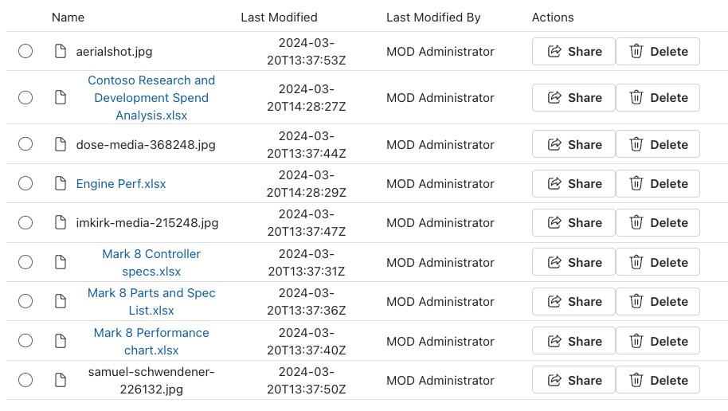
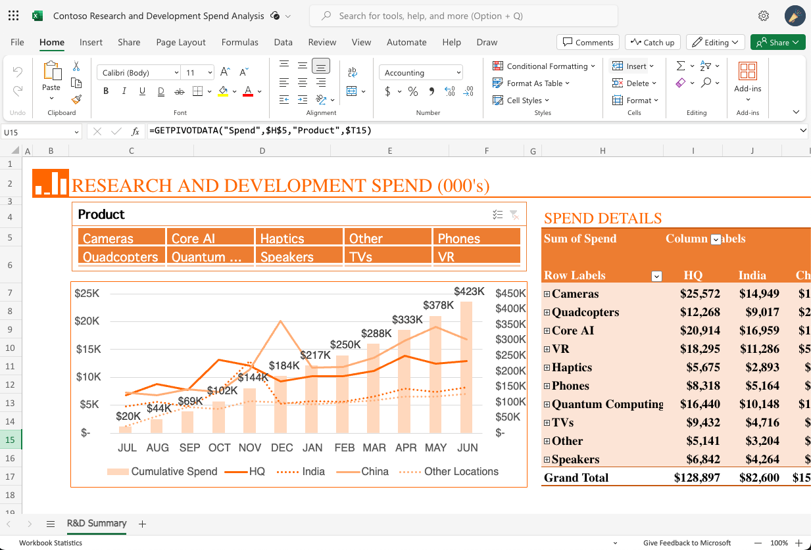
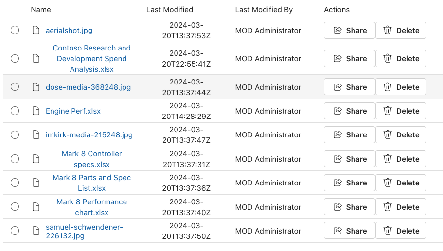
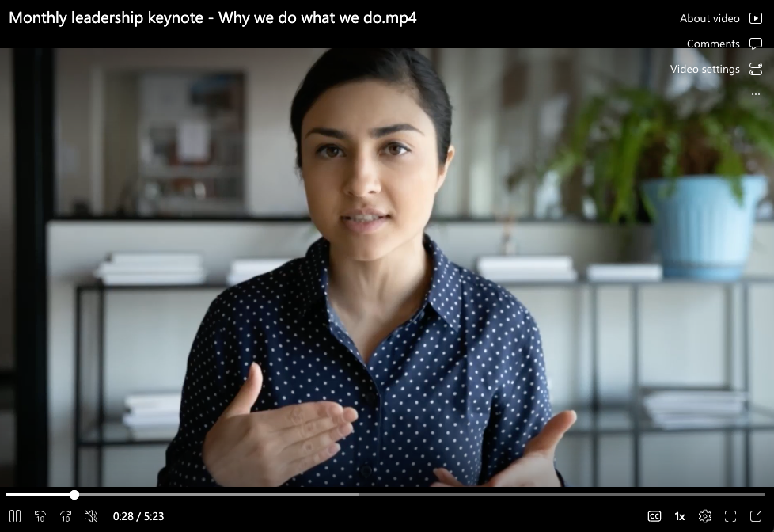
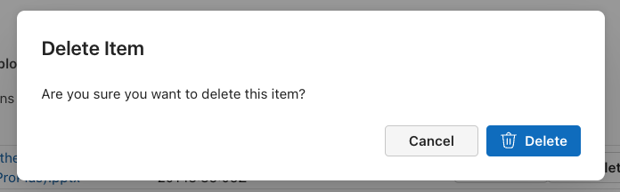
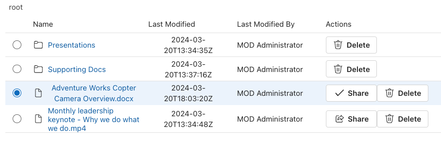

# Lab 03 - Working with Containers & Files

In this hands-on lab, you'll continue building out the React app by adding additional functionality to your first SharePoint Embedded (SPE) application. The exercises in this lab will walk you through adding document usage features to the app by utilizing Office collaboration capabilities with files stored in SPE Containers as well as previewing non-Office files such as images, PDFs and videos. You'll then add support for generating sharing links for the content as well as deleting files.

> [!IMPORTANT]
> This lab assumes you are working with the existing server-side API & React SPA projects found in the [sample-app/02-checkpoint](../sample-app/02-checkpoint/) folder. This is the final project from completing lab 02.
>
> **If you elect to start from the checkpoint instead of using the project you were updating in th e previous lab, remember to first install all the project's dependencies by running the `npm install` command in the root of the project. You'll also need to update the following files in the project with the relevant IDs and secrets for your specific SharePoint Embedded & Microsoft Entra application:**
>
> - ./.env
> - ./server/common/config.ts
> - ./src/common/config.ts
>
> At the end of this lab, your project should mirror the functionality in the projects found in the [sample-app/03-checkpoint](../sample-app/03-checkpoint/) folder. If you have trouble along the way, refer to that project for the working sample.

## Open Office files in Office for Web clients

The first step is to update the application to open Office files in the web clients. Using the [Office URI Schemes](https://learn.microsoft.com/office/client-developer/office-uri-schemes), you could also create a URL that would open the file in the respective Office desktop client, but this lab will focus on the using the Office for Web clients.

To do this, the app needs to determine if the current file one that can be opened in an Office for Web client. So, you need to add some code to determine the file extension and then conditionally send the user to the Office for Web client if the file type is supported.

To start, locate and open the **./src/components/Container.tsx** file. Locate the existing method `breadcrumbName()` and add the following new method `getFileExtension()`. This will extract the file extension from the current file:

```typescript
const getFileExtension = (fileName: string): string => {
  return fileName.split('.').pop() as string;
};
```

Next, jump down to the following line that starts a code block that defines all the columns in the **DataGrid**:

```typescript
const columns: TableColumnDefinition<IDriveItemExtended>[] = [
```

Immediately before this line, add the following array that contains a list of supported Office file types that can open in the Office for Web clients:

```typescript
const linkableFileTypes = new Set(['doc', 'docx', 'xlsx', 'xls', 'csv', 'pptx', 'ppt']);
```

The next step is to update the rendering logic of the first column in the **DataGrid**. Within the constant `columns` array of **TableColumnDefinitions**, locate the first column:

```tsx
createTableColumn({
  columnId: 'driveItemName',
  renderHeaderCell: () => {
    return 'Name'
  },
  renderCell: (driveItem) => {
    return (
      <TableCellLayout media={driveItem.iconElement}>
        {(!driveItem.isFolder)
          ? <Link href={driveItem!.webUrl!} target='_blank'>{driveItem.name}</Link>
          : <Link onClick={() => { navigateToFolder(driveItem) }}>{driveItem.name}</Link>
        }
      </TableCellLayout>
    )
  }
}),
```

Update the `return()` statement in the `renderCell()` method to return a **Link** that uses the current `driveItem`'s `webURL` property as the target when the item is selected as long as the file is one of the Office for Web client supported file types as determined by the file extension. This will open the Office client in a new browser tab.

However if the current file extension isn't supported, it will just display the name of the file without the link:

```tsx
createTableColumn({
  columnId: 'driveItemName',
  renderHeaderCell: () => {
    return 'Name'
  },
  renderCell: (driveItem) => {
    return (
      <TableCellLayout media={driveItem.iconElement}>
        {(!driveItem.isFolder)
          ? (linkableFileTypes.has(getFileExtension(driveItem.name as string)))
            ? <Link href={driveItem!.webUrl!} target='_blank'>{driveItem.name as string}</Link>
            : <div>{ driveItem.name as string }</div>
          : <Link onClick={() => { navigateToFolder(driveItem) }}>{driveItem.name}</Link>
        }
      </TableCellLayout>
    )
  }
}),
```

### Test opening supported files on Office for Web clients

Let's test our changes to the apps. Run the following command to build and start both the API server and client-side app server:

```console
npm start
```

After building & starting the application, the process will launch your default browser and navigate to the root of our React SPA. Sign-in if you aren't already signed in and select a Container.

If you haven't already, upload some Office files and non-office files (PDFs, images, and videos) from the [sample-content](../sample-content/) folder into the container. You should now see a mix of files in the view that are linked and unlinked:



Select one of the Office files. The respective Office for Web client will launch in a new browser tab and display the file you selected:



Repeat the process selecting different Office files to see them open in different Office for Web clients.

Now that Office files are opening in the web clients, the next step is to add support for opening the other file types.

Before continuing, stop the running processes by pressing <kbd>CTRL</kbd>+<kbd>C</kbd> in the console.

## Open non-Office files with preview links

SharePoint includes built-in preview client support for a wide range of file types, such as PDFs, images, videos, and many more. You can use this support to render previews of these file types from your SPE Containers directly in your app's web experience. These can be displayed within `iframe` controls or a new browser tab or window. Let's add support for viewing PDF's, images, and even streaming a video.

> [!TIP]
> You'll find all of these types of files in the [sample-content](../sample-content/) folder in this repository.

Start by locating the `getFileExtension()` method you added in the last exercise. Add the following method, `showFilePreview()`, immediately after it:

```typescript
const showFilePreview = async (driveItem: IDriveItemExtended): Promise<void> => {
  const graphClient = Providers.globalProvider.graph.client;
  const graphResponse = await graphClient.api(`/drives/${props.container.id}/items/${driveItem.id as string}/preview`)
                                         .post({});
  window.open(`${graphResponse.getUrl as string}&nb=true`, '_blank');
  return;
};
```

This method wil take the current file (ie: `driveItem`) and retrieve the preview link using the Microsoft Graph's `/preview` endpoint. It will then launch a new browser tab with the preview URL found in the response's `getUrl` property.

Next, let's replace the unlinked file name in our **DataGrid**'s first column with a linked preview link to the file.

Locate the same first column's definition you updated in the last exercise and find the `renderCell()` method's `return()` statement. Within the statement, find the unlinked filename:

```tsx
: <div>{ driveItem.name as string }</div>
```

Replace this with a **Link** control that calls the new `showFilePreview()` method when the it's selected:

```tsx
: <Link onClick={() => { showFilePreview(driveItem) }} >{driveItem.name as string}</Link>
```

Now let's test it out!

### Test opening supported files on Office for Web clients

Let's test our changes to the apps. Run the following command to build and start both the API server and client-side app server:

```console
npm start
```

After building & starting the application, the process will launch your default browser and navigate to the root of our React SPA. Sign-in if you aren't already signed in and select a Container.

If you haven't already, upload some non-office files (PDFs, images, and videos) from the [sample-content](../sample-content/) folder into the container. You should now see all files are linked:



Select one of the PDF files... the app will open a new tab with the rendered PDF:


Select one of the image files... the app will open a new tab with the rendered image:


Finally, select a video files... the app will open a new tab and start streaming the video!



Before continuing, stop the running processes by pressing <kbd>CTRL</kbd>+<kbd>C</kbd> in the console.

## Delete files in Containers

In this exercise, you'll update the React app to support deleting files from SPE Containers.

The React app currently displays a confirmation dialog when the user selects the **Delete** button on files or folders in the **DataGrid**. Once the user confirms the dialog prompt, you want to delete the file. However, the dialog show not disappear until after the file has been deleted.

To implement this, you need to make some changes to the Delete dialog. Locate an open the **./src/components/dialogs/DeleteConfirmation.tsx**.

Start by adding a **Spinner** control to the existing `import` statement for the `@fluentui/react-components` package that you'll use to indicate the application is currently working. Then, add an `import` statement to reference the **DeleteRegular** icon from the Fluent UI icon library:

```typescript
import {
  ... // existing imports
  Spinner
} from "@fluentui/react-components";
import { DeleteRegular } from '@fluentui/react-icons';
```

The deletion of the file will happen in the **Container** component, so we need to notify the **DeleteConfirmation** dialog when the delete operation is happening so we can display the **Spinner** control and disable the buttons in the dialog.

Start by adding a new property `isDeleting` to the `IDialogDeleteConfirmationProps` interface:

```typescript
export interface IDialogDeleteConfirmationProps {
  isOpen: boolean;
  isDeleting: boolean;
  onConfirm?: (confirmed: Boolean) => void;
}
```

Next, add a constant to the **DialogDeleteConfirmation** component before the existing `return()` statement. This will set the `deleteButtonIcon` constant to either the **Spinner** control or **DeleteRegular** icon when the app is deleting the file:

```tsx
const deleteButtonIcon = (props.isDeleting) ? <Spinner size='tiny' /> : <DeleteRegular />;
```

Now let's update the rendering of the dialog.

Within the `return()` statement, locate the dialog's **DialogTriggers** section and add an `disabled` attribute to the *Cancel* button. This will disable the button when the app is currently deleting the file:

```tsx
<Button
  appearance='secondary'
  disabled={props.isDeleting}
  onClick={() => { if (props.onConfirm) { props.onConfirm(false); } }}>Cancel</Button>
```

Finally, update the *Delete* button by adding the `icon` and `disabled` attributes. This will cause the icon on the button to be dynamic and provide some feedback to the user that the file is being deleted.

```tsx
<Button
  appearance='primary'
  icon={deleteButtonIcon}
  disabled={props.isDeleting}
  onClick={() => { if (props.onConfirm) { props.onConfirm(true); } }}>Delete</Button>
```

The last step is to update the **Container** component to update the dialog and delete the file.

Locate and open the **./src/Container.tsx** file.

Start by adding a new state variable to the existing state properties near the top of the **Container** component:

```typescript
const [isDeleting, setIsDeleting] = useState(false);
```

Add this state variable to the **DialogDeleteConfirmation** dialog... scroll down to the component's `return()` statement and locate the **DialogDeleteConfirmation** component. Add the attribute `isDeleting` and bind it to the state variable you just added - `isDeleting`:

```tsx
<DialogDeleteConfirmation
  isOpen={deleteDialogOpen}
  isDeleting={isDeleting}
  onConfirm={(confirmed) => { (confirmed) ? onDeleteItemClick() : setDeleteDialogOpen(false); }} />
```

Next, locate the `onDeleteItemClick()` method. Replace the following line:

```typescript
await new Promise(resolve => setTimeout(resolve, 250));
```

... with the following code. This uses the Microsoft Graph's `/items` endpoint for a specific item to delete it. Before submitting the call to to the Microsoft Graph, it first sets the `isDeleting` state variable to `true`:

```typescript
setIsDeleting(true);

const graphClient = Providers.globalProvider.graph.client;
await graphClient.api(`/drives/${props.container.id}/items/${selectedRows.entries().next().value[0]}`)
                 .delete();
```

Finally, add a call to `setIsDeleting(false);` as the last line in the method:

```typescript
const onDeleteItemClick = async () => {
  setIsDeleting(true);

  const graphClient = Providers.globalProvider.graph.client;
  await graphClient.api(`/drives/${props.container.id}/items/${selectedRows.entries().next().value[0]}`)
                   .delete();

  await loadItems(folderId || 'root');
  setDeleteDialogOpen(false);
  setIsDeleting(false); // <<< add this line
};
```

### Test deleting files

Let's test our changes to the apps. Run the following command to build and start both the API server and client-side app server:

```console
npm start
```

After building & starting the application, the process will launch your default browser and navigate to the root of our React SPA. Sign-in if you aren't already signed in and select a Container.

Select the **Delete** button next to one of the files. The app will display the delete modal dialog:



Select the **Delete** button in the dialog. You'll see the **Spinner** control appear when the buttons are disabled. After a moment, the dialog will disappear and the file will no longer be present.

Before continuing, stop the running processes by pressing <kbd>CTRL</kbd>+<kbd>C</kbd> in the console.

## Create sharing links with Microsoft Graph

In this final exercise, you'll create a sharing link using Microsoft Graph that you can sent to other people in your organization to access the shared file.

Start by locating and opening the **./src/components/Container.tsx** file. Next, find the `onCreateShareLinkClick()` method.

Replace the following line:

```typescript
await new Promise(resolve => setTimeout(resolve, 750));
```

... with the following code:

```typescript
const graphClient = Providers.globalProvider.graph.client;

const requestBody = {
  "type": "view",
  "scope": "organization"
};

const graphResponse = await graphClient.api(`/drives/${props.container.id}/items/${driveItem.id as string}/createLink`)
                                       .post(requestBody);
driveItem.shareUrl = graphResponse.link.webUrl;
```

This will use the Microsoft Graph's `/createLink` endpoint on a file to generate a sharing link that other users within your organization will be able to view, but not edit, the file.

Next, update the last line in the method to replace:

```typescript
driveItem.shareUrl = 'https://contoso.com/file.txt';
```

... with the following line:

```typescript
navigator.clipboard.writeText(driveItem.shareUrl as string);
```

This will save the link returned by the Microsoft Graph to the use's clipboard. The user will see the link has been saved with the checkmark on the **Share** button:

### Test sharing files in Containers

Let's test our changes to the apps. Run the following command to build and start both the API server and client-side app server:

```console
npm start
```

After building & starting the application, the process will launch your default browser and navigate to the root of our React SPA. Sign-in if you aren't already signed in and select a Container.

Select the **Share** button next to one of the files. The app after a moment, the button will change from the share icon to a checkmark. Open a text file and paste the contents of the clipboard to the text file to see the link that was copied to the clipboard.



Before continuing, stop the running processes by pressing <kbd>CTRL</kbd>+<kbd>C</kbd> in the console.

## Summary

In this hands-on lab, you continued building out the React app by adding additional functionality to your first SharePoint Embedded (SPE) application. The exercises in this lab walked you through adding document usage features to the app by utilizing Office collaboration capabilities with files stored in SPE Containers as well as previewing non-Office files such as images, PDFs and videos. You then added support for generating sharing links for the content as well as deleting files.
