# Running the Syntex repository services samples in VSCode docker devcontainers. 

Requirements: 

1. Install Docker Desktop. 
2. Install VSCode. 
3. Install the “Dev Containers” extension and the “Docker” extension. 

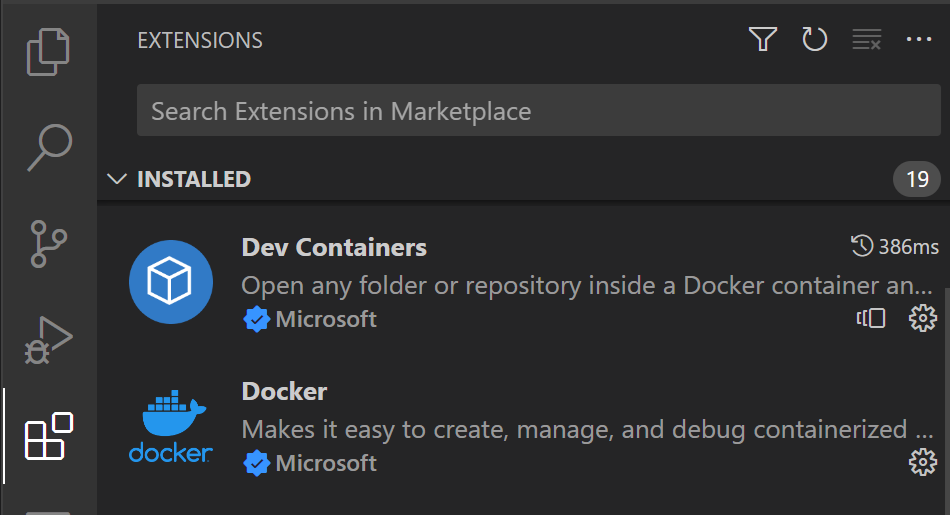

4. If using Windows you will also need the WSL extension.

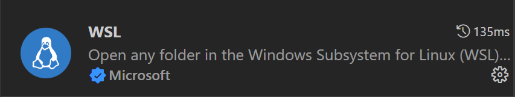

5. You will need the configuration files provided to you by email.
`.env`, `appsettings.json`, `credentials.json`, and `local.settings.json` will all be needed to run the examples.

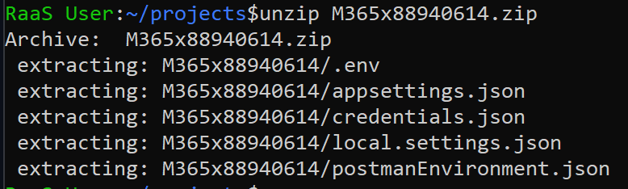


### Steps:
1.	Clone the repo. 

&nbsp;&nbsp;&nbsp;&nbsp;&nbsp;&nbsp;&nbsp;&nbsp;&nbsp;&nbsp;&nbsp; *If you are in Windows you must be using WSL and clone the repo in the WSL filesystem. This is important, if you do it in the Windows filesystem it won’t work as expected.
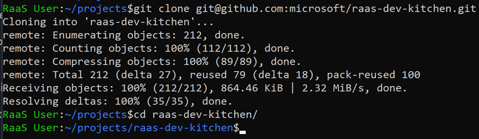

2. Copy the configuration files into the following raas-dev-kitchen folders.
```sh
cp .env ~/projects/raas-dev-kitchen/Samples/raas-spa-azurefunction/packages/client-app/

cp appsettings.json ~/projects/raas-dev-kitchen/Samples/raas-asp.net-webservice/

cp local.settings.json ~/projects/raas-dev-kitchen/Samples/raas-spa-azurefunction/packages/azure-functions/
```
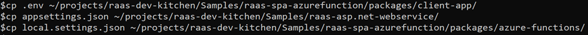

3. Open the raas-dev-kitchen sample folders in VSCode. You can do this for each of the samples:
 ‘`raas-dev-kitchen/Samples/raas-asp.net-webservice/`’ and 
 ‘`raas-dev-kitchen/Samples/raas-spa-azurefunction`'

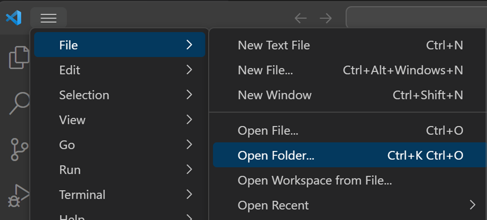

*If in WSL, you will need to open the folder in WSL. Start by clicking the open remote window green button in the bottom left of your VSCode window.

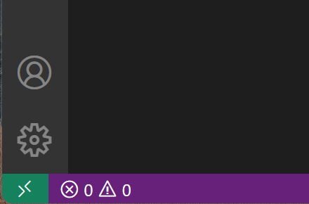

This will open the dropdown from the command menu where you can select ’Open Folder in WSL’.

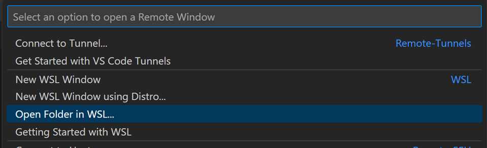

4. You will likely see one of the bottom right popup windows say the following.

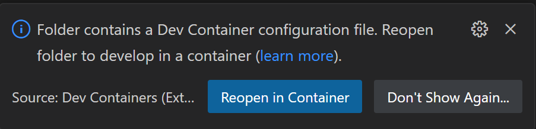

Go ahead and reopen in container. If you do not see this popup, you can always click the bottom left green button again and in the dropdown select Reopen in Container.

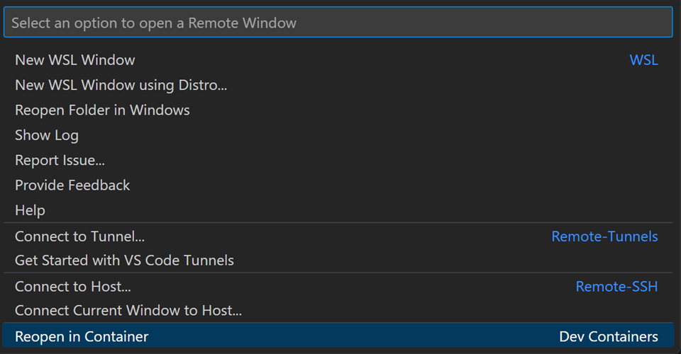

5.	The container will start building automatically. You will likely see a popup to show logs. Go ahead an click on it and watch the container build.

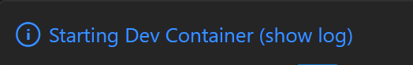

6.	Now open a new terminal window in VSCode.

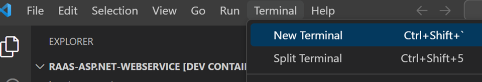

7.	For ‘raas-asp.net-webservice’:

a.	You will need to open the file `appsettings.json`.

b.	Replace the conection string:
```json
‘"RaaSAppConnStr": "Data Source=(localdb)\\MSSQLLocalDB;Initial Catalog=RaaSDemoAppDb;Integrated Security=True;Connect Timeout=30;"’
```
 with 

```json
‘"RaaSAppConnStr": "Data Source=localhost;Encrypt=false;Initial Catalog=RaaSDemoAppDb;User Id=sa;Password=P@ssw0rd;Connect Timeout=30"’
```
This will ensure it connects to the container SQL service.

c.	From the terminal you can start the sample service with ‘dotnet build’ enter, and then ‘dotnet run’ enter.

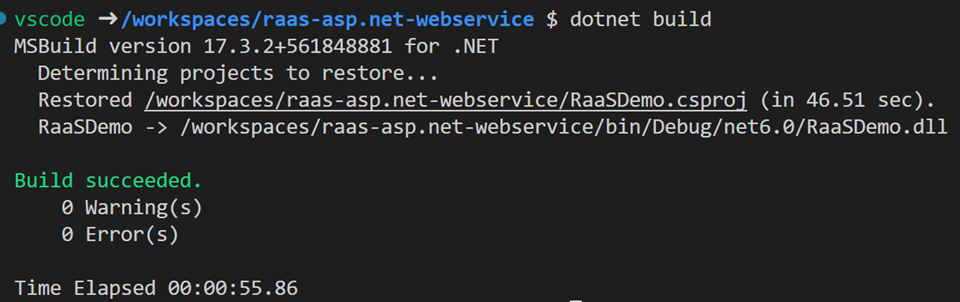
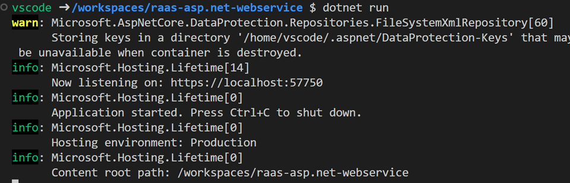

d.	Finally you can go to your local browser and access [https://localhost:57750](https://localhost:57750). You will need to accept the self-signed certificate before you can go to the demo. 


8.	For ‘`raas-asp.net-webservice`’:

a.	Once this sample opens in the devcontainer you should see on the left toolbar the azure functions icon. Please click on that.

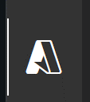

b.	This will give you access to the azure functions workspace. Drill down the workspace menu until you see “initialize Project for Use with VS Code...” and click on that.

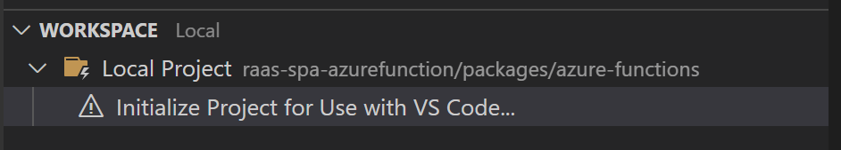

c.	This will open the command menu at the top. Select ‘Javascript’

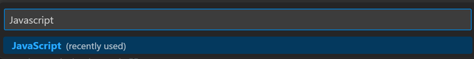

d.	Once finished, in the workspace menu you can select the refresh button.

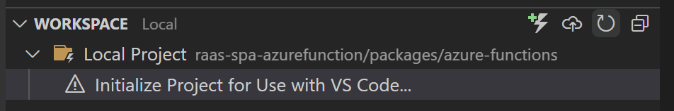

This will populate your project with the azure functions.

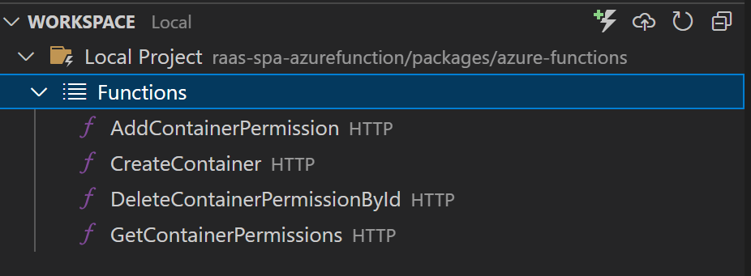

e.	Execute the azure functions by selecting  ‘Start Debugging’ or F5

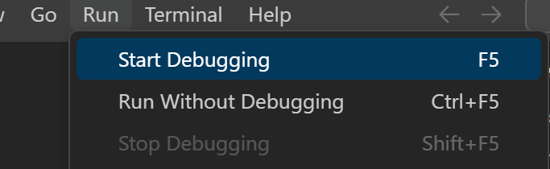

f.	A new terminal window should open and it should end up like the following:

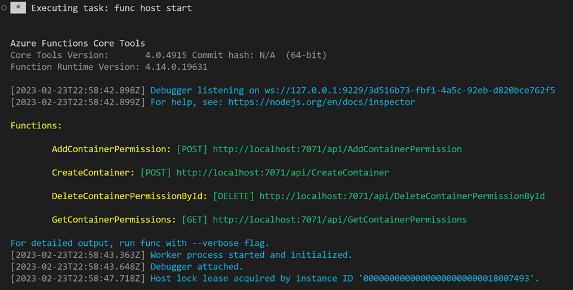

Opening a browser to [http://localhost:7071](http://localhost:7071) and you will see the following successful function app up and running.

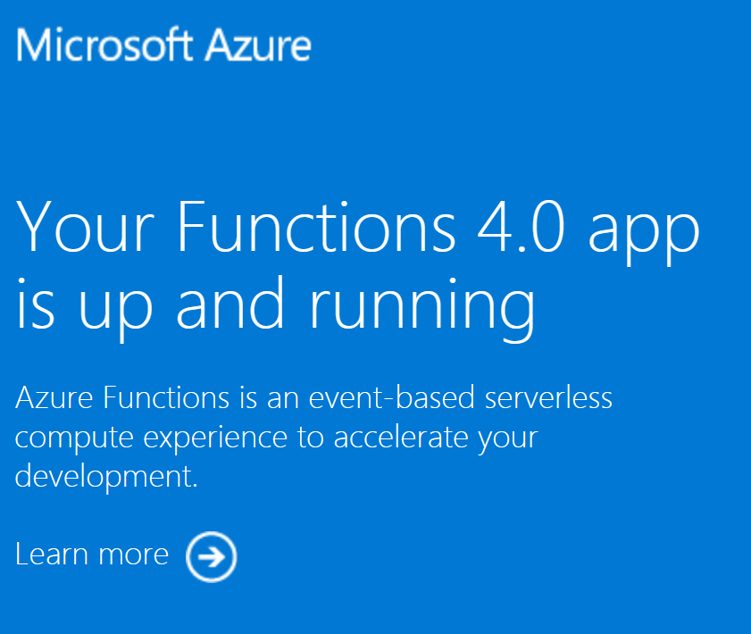

g.	To run the React webpage part of the application run the following in a new terminal. This could take a bit of time.
```sh
npm run lerna
```

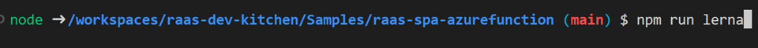

This is just a shortcut to the following two commands:
```sh
‘npm install’
‘npm lerna run start --scope=raas-client-app’
```


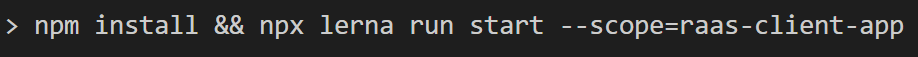

h.	Load your new app running on [http://localhost:3000](http://localhost:3000).