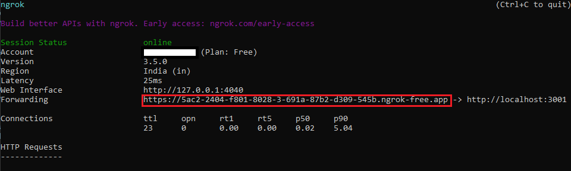

# Using Webhooks and Enabling Document Processing with ACS Tutorial
This tutorial aims to walk you through the process of using webhooks to invoke the Azure Cognitive Service APIs from the [application you have created](https://learn.microsoft.com/en-us/training/modules/sharepoint-embedded-create-app/) whenever an existing file is updated or a new file is created.  

# Table of Contents
- [Create and register a webhook](#create-and-register-a-webhook)
- [Connect to Graph and subscribe to changes](#connect-to-graph-and-subscribe-to-changes)
- [Get the delta changes of a container](#get-the-delta-changes-of-a-container)
- [Call ACS's Document Intelligence service API](#call-acss-document-intelligence-service-api)

## Create and register a webhook
Create a webhook endpoint through which you will get a notification whenever there is change in container.
Open the `index.ts` file and add an endpoint `onReceiptAdded`.
```ts
server.post('/api/onReceiptAdded', async (req, res, next) => {
  try {
    const response = await onReceiptAdded(req, res);
    res.send(200, response)
  } catch (error: any) {
    res.send(500, { message: `Error in API server: ${error.message}` });
  }
  next();
});
```

You also need to add the query parser plugin at the top of this file so that it runs at server startup.
```ts
server.use(restify.plugins.bodyParser(), restify.plugins.queryParser()); 
```

Create `onReceiptAdded.ts` and implement the method `onReceiptAdded` to read `validationToken` and `driveId`. `validationToken` is required when Graph makes a one-time call to verify the endpoint upon creation of the webhook subscription. `driveId` is the container-id for which  the subscription is created.
```ts
require('isomorphic-fetch');

  export const onReceiptAdded = async (req: Request, res: Response) => {
    
    
    const validationToken = req.query['validationToken'];
    if (validationToken) {
        res.send(200, validationToken, {"Content-Type":"text/plain"});
        return;
    }

    const driveId = req.query['driveId'];
    if (!driveId) {
        res.send(200, "Notification received without driveId, ignoring", {"Content-Type":"text/plain"});
        return;
    }

    console.log(`Received driveId: ${driveId}`);

    res.send(200, "");
    return;
  }
```

## Connect to Graph and subscribe to changes
Follow the documentation to create a tunnel for your backend server by utilizing ngrok.
After starting the app, run the following command in a terminal:
```pwsh
ngrok http 3001
```

On successful completion, you should get the following output. The public facing endpoint for app is highlighted in red rectangle.


Once the tunneling is active, you can subscribe to delta changes in container by adding the webhook URL. To do that, open Postman and make the following `POST` request with appropriate graph access token and `notificationUrl` with the `driveId` appended as a query parameter to ensure that you get notifications for changes only in the desired container. 
```json
POST  https://graph.microsoft.com/v1.0/subscriptions 
{ 
  "changeType": "updated", 
  "notificationUrl":"https://5ac2-2404-f801-8028-3-691a-87b2-d309-545b.ngrok-free.app/api/onReceiptAdded?driveId={{ContainerId}}", 
  "resource": "drives/{{ContainerId}}/root", 
  "expirationDateTime": "2024-01-20T03:58:34.088Z", 
  "clientState": "" 
} 
```

You can use the following code snippet for setting the max possible expiration time of 4230 minutes from the current time by adding this to the "Pre-request Script" section. It will set an environment variable which can be used in request body. 
```js
var now = new Date()
var duration = 1000 * 60 * 4230; // max lifespan of driveItem subscription is 4230 minutes
var expiry = new Date(now.getTime() + duration);
var expiryDateTime = expiry.toISOString();

pm.environment.set("ContainerSubscriptionExpiry", expiryDateTime);
```

At this point, if you add/update any file in the container, you will get notification at previously added endpoint (`/api/onReceiptAdded`) and a log message at console:
`Received driveId: <containerId>`

## Get the delta changes of a container
Open `GraphProvider.ts` and implement method `getDriveChanges` to get the list of changed items.
```ts
public static async getDriveChanges(driveId: string): Promise<any[]> {
    let changedItems: any[] = [];
    const driveDeltaBasePath: string = `/drives/${driveId}/items/root/delta`;
    let driveDeltaTokenParams: string = "";
    let hasMoreChanges: boolean = true;
    try{
        do {
            if (this.changeTokens.has(driveId)) {
                driveDeltaTokenParams = `?token=${this.changeTokens.get(driveId)}`
            }
            const response = await this.graphClient.api(driveDeltaBasePath + driveDeltaTokenParams).get();
            changedItems.push(...response.value);
            if (response['@odata.nextLink']) {
                const token = new URL(response['@odata.nextLink']).searchParams.get('token');
                this.changeTokens.set(driveId, token);
            } else {
                hasMoreChanges = false;
                const token = new URL(response['@odata.deltaLink']).searchParams.get('token');
                this.changeTokens.set(driveId, token);
            }
            console.log(this.changeTokens.get(driveId));
        } while (hasMoreChanges);
    }
    catch(err){
        console.log(err);
    }
    return changedItems;
}
```

Implement method `getDriveItem` to fetch a file from a container.
```ts
public static async getDriveItem(driveId: string, itemId: string): Promise<any> {
    return await this.graphClient.api(`/drives/${driveId}/items/${itemId}`).get();
}
```

Create a new file `ReceiptProcessor.ts` and implement a method `processDrive`.
```ts
export abstract class ReceiptProcessor {

    public static async processDrive(driveId: string): Promise<void> {
        const changedItems = await GraphProvider.getDriveChanges(driveId);
        for (const changedItem of changedItems) {
            try {
                const item = await GraphProvider.getDriveItem(driveId, changedItem.id);
                const extension = this.getFileExtension(item.name);
                if (this.SUPPORTED_FILE_EXTENSIONS.includes(extension.toLowerCase())) {
                    console.log(item.name);
                    const url = item["@microsoft.graph.downloadUrl"];
                    const receipt = await this.analyzeReceiptStream(await this.getDriveItemStream(url));
                    const receiptString = JSON.stringify(receipt, null, 2)
                    const fileName = this.getFileDisplayName(item.name) + "-extracted-fields.json";
                    const parentId = item.parentReference.id;
                    await GraphProvider.addDriveItem(driveId, parentId, fileName, receiptString);
                }
            } catch (error) {
                console.log(error);
            }
        }

    }
```  

At this point if you restart the app along with tunneling and subscription, you should see the recently added/updated files listed in console.

## Call ACS's Document Intelligence service API
To use the ACS Document Intelligence APIs, you need to create a Multi-Service or Document Intelligence resource for Azure AI services. Follow the tutorials below to create the resource:
•	[Quickstart: Create a multi-service resource for Azure AI services](https://learn.microsoft.com/en-us/azure/ai-services/multi-service-resource?tabs=windows&pivots=azportal)
•	[Get started with Document Intelligence](https://learn.microsoft.com/en-gb/azure/ai-services/document-intelligence/quickstarts/get-started-sdks-rest-api?view=doc-intel-3.1.0&viewFallbackFrom=form-recog-3.0.0&preserve-view=true&pivots=programming-language-javascript)

After this step, you should have an endpoint and a key ready to use.

Now open `ReceiptProcessor.ts` to create method `dac` to store the ACS credentials.
```ts
private static dac = new DocumentAnalysisClient(
    `${process.env["DAC_RESOURCE_ENDPOINT"]}`,
    new AzureKeyCredential(`${process.env["DAC_RESOURCE_KEY"]}`)
);
```

Create method `getDriveItemStream`.
```ts
private static async getDriveItemStream(url: string): Promise<Readable> {
        const token = GraphProvider.graphAccessToken;
        const config: AxiosRequestConfig = {
            method: "get",
            url: url,
            headers: {
                "Authorization": `Bearer ${token}`
            },
            responseType: 'stream'
        };
        const response = await axios.get<Readable>(url, config);
        return response.data;
    }
```

Create method `analyzeReceiptStream` to get the OCR fields through ACS processing. Here we are taking the `prebuilt-invoice` model, but other models can be chosen.
```ts
private static async analyzeReceiptStream(stream: Readable): Promise<any> {

        const poller = await this.dac.beginAnalyzeDocument("prebuilt-invoice", stream, {
            onProgress: ({ status }) => {
                console.log(`status: ${status}`);
            },
        });

        const {
            documents: [result] = [],
        } = await poller.pollUntilDone();

        const fields = result?.fields;
        this.removeUnwantedFields(fields);
        return fields;
    }
```

Create method `removeUnwantedFields` to remove the undesireable fields in ACS’s repsonse.
```ts 
private static removeUnwantedFields(fields: any) {
        for (const prop in fields) {
            if (prop === 'boundingRegions' || prop === 'content' || prop === 'spans') {
                delete fields[prop];
            }
            if (typeof fields[prop] === 'object') {
                this.removeUnwantedFields(fields[prop]);
            }
        }
    }
```

Finally, open `GraphProvider.ts` to add the `addDriveItem` method at the end of the `GraphProvider` class.
```ts 
public static async addDriveItem(driveId: string, parentId: any, fileName: string, receiptString: string) {
        await this.graphClient.api(`/drives/${driveId}/items/${parentId}:/${fileName}:/content`).put(receiptString);
    }
```

Now, restart the demo app and setup the tunneling using ngrok and delta change subscription on the container again.
If you add/update any file (supported formats: 'JPEG', 'JPG', 'PNG', 'BMP', 'TIFF', 'PDF') in this container, you should see a new JSON file created and contains the fields extracted from file.
