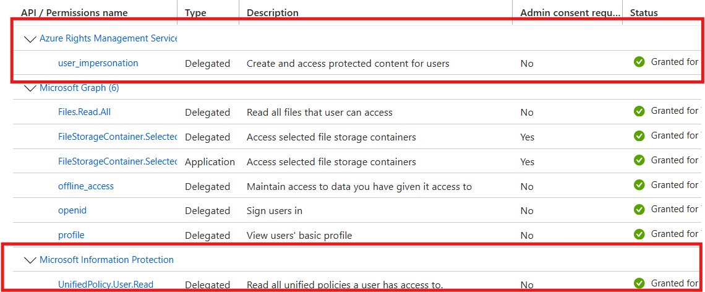

# SharePoint Embedded MIP File Viewer Integration Guide

## Overview

This guide explains how to integrate the `EmbedIFrameV2Next` component into your React application to display Microsoft Information Protection (MIP) protected files from SharePoint Embedded containers. This solution enables secure viewing of protected documents by implementing proper cross-window communication and token exchange protocols.

## Prerequisites

- React application with TypeScript support
- SharePoint Embedded container setup
- Azure Active Directory app registration with appropriate permissions
- Microsoft Information Protection (MIP) licensing for your tenant
- Azure Rights Management Service token capability

## Architecture Overview

The solution consists of several key components:

1. **EmbedIFrameV2Next**: Main React component that renders the SharePoint embed iframe
2. **useMessagePort**: Custom hook for secure cross-window communication
3. **MipAuthProvider**: Authentication provider for Azure Rights Management tokens
4. **Supporting utilities**: URL helpers, constants, and interfaces

## Required Files and Components

### 1. Core Component: EmbedIFrameV2Next.tsx

This is the main component that handles the embedded SharePoint viewer. The component requires the following props:

```typescript
interface IEmbedIFrameProps {
  actionUrl: string;    // SharePoint embed URL with parameters
  mockData: IMockData;  // Configuration and token data
  context?: string;     // Optional context data
  authToken?: string;   // Optional auth token
}
```

**Key Features:**
- Creates an iframe with SharePoint embed content
- Handles secure token exchange via MessagePort API
- Manages communication lifecycle with embedded viewer
- Supports MIP-protected file viewing

### 2. Communication Hook: useMessagePort.ts

**Changes Made:**
The `useMessagePort` hook has been enhanced to support MIP token exchange:

- **Origin Validation**: Uses case-insensitive origin comparison for SharePoint domains
- **Channel ID Verification**: Validates messages using unique channel identifiers
- **MessagePort Communication**: Establishes secure MessagePort-based communication (more secure than direct postMessage)
- **Source Window Validation**: Optionally validates the source window (iframe.contentWindow)
- **Timeout Handling**: Manages initialization timeouts with configurable duration (default 10s)

**Key Implementation Features:**
```typescript
export function useMessagePort(
  channelId: string,           // Unique identifier for this communication channel
  origin: string,              // Expected origin of the embed page
  source: Window | undefined,  // Source window (iframe.contentWindow)
  initTimeoutMs = 10000       // Initialization timeout
): MessagePort | undefined
```

**Enhanced Security:**
- Uses MessagePort instead of direct postMessage for better isolation
- Validates both origin and source window
- Requires exact channel ID match for initialization

### 3. MIP Authentication Provider

**Requirement:** You **must** have Azure Rights Management Service tokens to view MIP-protected files.

The `MipAuthProvider` class provides:
- MSAL integration for Azure AD authentication
- Specific scopes for Azure Rights Management (`https://aadrm.com/user_impersonation`)
- Silent token acquisition with popup fallback
- Proper token caching and refresh handling

```typescript
export class MipAuthProvider {
  // Singleton instance
  public static readonly instance: MipAuthProvider = new MipAuthProvider();
  
  // Get Azure Rights Management token
  async getToken(scopes: string[] = MIP_SCOPES): Promise<string>
  
  // Check if user is signed in
  async isSignedIn(): Promise<boolean>
}
```

## Implementation Steps

### Step 1: Implement Core Components

You need to implement the following core components in your React application. We provide complete sample implementations that you can adapt:

#### Required Components:
1. **EmbedIFrameV2Next Component** - Main embed viewer component
2. **useMessagePort Hook** - Secure cross-window communication
3. **MipAuthProvider Class** - Azure Rights Management authentication
4. **Interface Definitions** - TypeScript interfaces for type safety
5. **URL Helper Utilities** - Embed option encoding and URL construction

#### Sample Implementation Files:
- `src/components/EmbedIFrameV2Next.tsx` - Complete embed component implementation
- `src/utils/useMessagePort.ts` - MessagePort communication hook
- `src/providers/MipAuthProvider.ts` - MIP authentication provider
- `src/common/interface.ts` - TypeScript interface definitions
- `src/utils/urlHelper.ts` - URL construction utilities

### Step 2: Configure Azure App Registration

Update your Azure app registration in the Azure Portal to include the required API permissions:

#### Required API Permissions:
1. **Azure Rights Management Services** 
   - Permission: `user_impersonation`
   - Type: Delegated permission
   - Required for: Accessing MIP-protected content

2. **Microsoft Information Protection**
   - Permission: `UnifiedPolicy.User.Read`
   - Type: Delegated permission
   - Required for: Read all unified policies a user has access to.

   

#### Configuration Steps:
1. Navigate to Azure Portal > App registrations > Your app
2. Go to "API permissions"
3. Click "Add a permission"
4. Add each of the permissions listed above
5. Grant admin consent for your organization (if required)

### Step 3: Create Configuration Constants

Add the following to `src/common/Constants.ts`:

```typescript
export const MIP_HOST = 'https://your-sharepoint-domain.sharepoint.com';
export const MIP_REACT_APP_URL = 'http://localhost:8080'; // React App URL, in our case localhost:8080
```

### Step 4: Integrate into Your Application

Follow the pattern shown in `ContainerBrowser.tsx` for integrating the embed viewer into your application workflow.

## Key Configuration Options

### Embed Options

```typescript
const embedOptions = {
  id: 'unique-viewer-id',     // Unique identifier for this embed instance
  mpmp: true,                 // **REQUIRED** - Enable MIP protection support
  htp: false,                 // **REQUIRED** - Force token requests to host app
  mpe: false,                 // Allow editing in MsPdf viewer
  mpoe: false                // Open MsPdf viewer in edit mode
};
```

### Embed Settings Explained

- **`mpmp: true`** - Enables Microsoft Information Protection support in the embedded viewer
- **`htp: false`** - Forces the embedded viewer to request tokens from your host application rather than trying to authenticate independently
- **Channel ID** - Must be unique and consistent between the embed URL and the host configuration

## Token Exchange Protocol

The embedded viewer will request tokens via the following flow:

1. **Initialization**: Embedded page sends initialization message with channel ID and MessagePort
2. **Activation**: Host responds with activation message to establish the communication channel
3. **Token Request**: Embedded page sends `getToken` command with token type via MessagePort
4. **Acknowledgment**: Host immediately acknowledges receipt of the command
5. **Token Response**: Host provides the appropriate token via MessagePort
6. **Content Access**: Embedded viewer uses token to decrypt and display MIP-protected content

### Token Type You Need

- **AZ_RMS** - Azure Rights Management Service (required for MIP files)

## Security Considerations

1. **Origin Validation**: Always validate message origins in production
2. **Token Scope**: Ensure MIP tokens have appropriate scopes for your use case
3. **Token Expiration**: Handle token refresh when tokens expire
4. **HTTPS Required**: Use HTTPS in production for secure token exchange

## Complete Example Implementation

For a complete working example, refer to the implemented code in this repository:

### Main Integration Component
- **File**: `src/components/ContainerBrowser.tsx`
- **Key Functions**: 
  - `onFilePreviewSelected()` - Handles file selection and token acquisition
  - Modal rendering with `EmbedIFrameV2Next` component
  - MIP token retrieval using `MipAuthProvider.instance.getToken()`

### Core Embed Component
- **File**: `src/components/EmbedIFrameV2Next.tsx`
- **Features**:
  - MessagePort-based communication with embedded viewer
  - Token request handling for different token types
  - Performance and error notification processing
  - Secure iframe rendering with form POST

### Communication Hook
- **File**: `src/utils/useMessagePort.ts`
- **Features**:
  - Secure MessagePort establishment
  - Origin and source validation
  - Initialization timeout handling
  - Case-insensitive origin comparison

### Authentication Provider
- **File**: `src/providers/MipAuthProvider.ts`
- **Features**:
  - MSAL integration for Azure AD
  - Azure Rights Management token acquisition
  - Silent token refresh with popup fallback
  - Singleton pattern implementation

### Usage Example from ContainerBrowser.tsx

```typescript
const onFilePreviewSelected = async (file: IDriveItem) => {
  setPreviewFile(file);
  setIsPreviewOpen(true);

  // Get the preview URL
  const url = await filesApi.getPreviewUrl(containerId, file.id);
  if (url) {
    setPreviewUrl(url);
    
    // Get MIP auth token
    const authProvider = MipAuthProvider.instance;
    const token = await authProvider.getToken();
    mockData.accessToken = token;
    
    if (file.downloadUrl) {
      mockData.downloadUrl = file.downloadUrl;
    }
  }
};

// In the Modal render:
<EmbedIFrameV2Next
  actionUrl={previewUrl.toString() + `&embed=${embedOptions}` + `#channelId=${mockData.channelId}&origin=${hostOrigin}`}
  mockData={mockData}
/>
```

This implementation provides secure, compliant viewing of MIP-protected files in your React application while maintaining proper authentication boundaries and security protocols.

### Key Implementation Details

1. **Token Management**: The `mockData` object stores the MIP token obtained from `MipAuthProvider`
2. **URL Construction**: Embed options and channel information are appended to the SharePoint preview URL
3. **Secure Communication**: MessagePort-based communication ensures proper isolation between host and embedded content
4. **Error Handling**: Comprehensive error handling for token acquisition, communication timeouts, and rendering failures

The complete implementation demonstrates production-ready patterns for integrating SharePoint Embedded MIP file viewing capabilities into React applications.

## Troubleshooting

### Common Issues

1. **"Message port initialization timed out after 10000ms"**
   - Check that channelId matches between URL and configuration
   - Verify origin settings are correct
   - Ensure the iframe is properly loaded before MessagePort initialization

2. **"Token authentication failure"**
   - Ensure you have valid Azure Rights Management licenses
   - Verify MIP token scopes include `https://aadrm.com/user_impersonation`


### Required Azure Permissions

Your Azure app registration must include:

- **Azure Rights Management Services**: `user_impersonation`
- **Microsoft Graph**: `User.Read`, `FileStorageContainer.Selected`

## MIP Licensing Requirements

**Critical**: Microsoft Information Protection functionality requires appropriate licensing:

- Azure Information Protection P1 or P2
- Microsoft 365 E3/E5 (includes AIP)
- Enterprise Mobility + Security E3/E5

Without proper MIP licensing, protected files cannot be viewed even with correct token implementation.